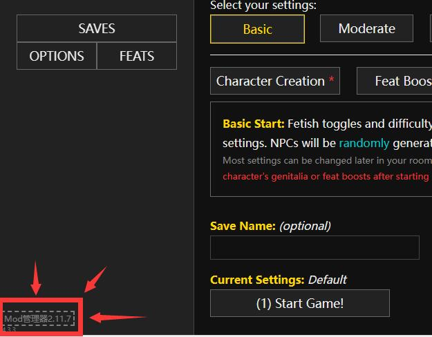
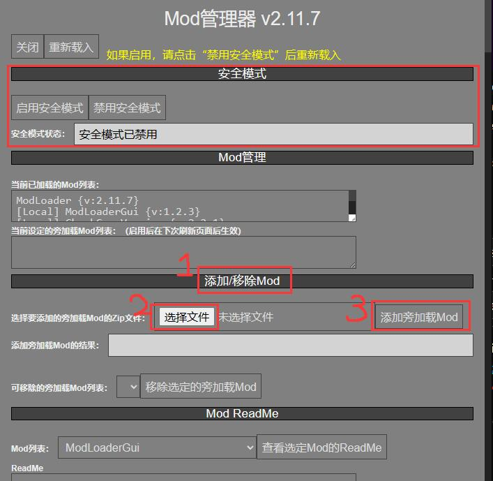
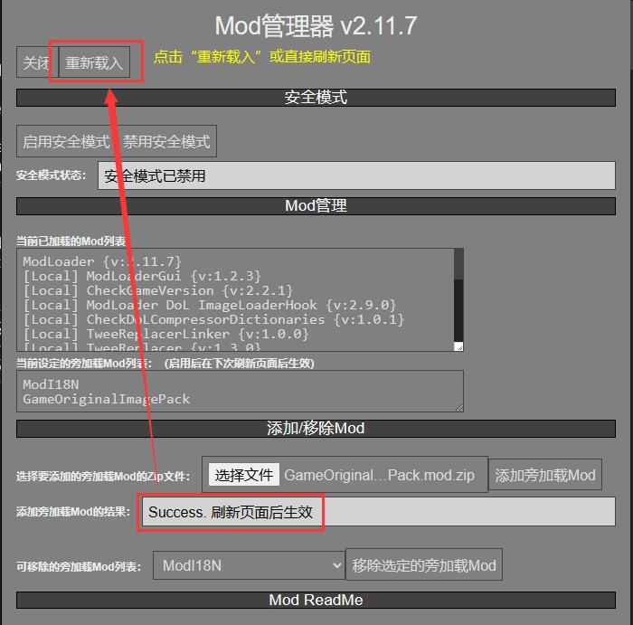

# Degrees of Lewdity 中文本地化发布库

---

汉化版 Discord 交流服务器：

---

# 请在下载游玩前首先阅读本说明文档 对于在文档中写明的内容仍进行提问的将不作解答

---

## 目录

* [简介](#简介)
  * [写在最前](#写在最前)
  * [关于本仓库](#关于本仓库)
  * [关于游戏发布下载](#关于游戏发布下载)
  * [关于版本号](#关于版本号)
* [免责声明](#免责声明)
* [致谢名单](#致谢名单)
* [更新日志](#更新日志)

---

## 简介
### 写在最前...
-  <b>游戏作者</b> $\color{purple} {Vrelnir}$

  - [Vrelnir 的博客][blog]
  - [英文游戏维基][wiki-en]
  - [中文游戏维基][wiki-cn]
  - [官方 Discord][discord]
  - [游戏源码仓库][gitgud]

### 关于本仓库

本仓库将会不定期放出游戏的简体中文本地化版本，仅供交流学习，请于下载后 24 小时内删除。如果你未满 18 岁，请勿下载此游戏。仓库本身不含游戏相关内容，仅作为发布地址。**对在其它平台下载的汉化游戏文件不保证安全性，请谨慎下载。**

游戏完全免费游玩，**严禁**将中文本地化版本**用作商业盈利用途**或**公开大肆传播**，对于商业盈利或公开传播导致的可能法律后果完全由使用者自行承担，与汉化成员无关。

如在游玩过程中遇到任何问题，或对汉化文本有建议，请[发布 issue(议题)][issues] 反馈，反馈时请附上出现问题时的**截图 + 游戏存档文件 / 游戏存档代码**，在其它平台反馈问题可能得不到回应。请不要删除自己的议题, 方便后来人查阅相关问题。请注意，本仓库仅解决由于游戏汉化版本导致的问题，如果问题在英文版能复现，请去游戏官方 [Discord][discord] 反映。

### 关于游戏发布下载

本仓库发布的模组加载器和汉化包，与二者各自打包仓库发布的完全相同。自动打包仓库的更新将比本仓库更新更频繁。有需要的玩家也可以自行前往对应仓库下载：

|    模组加载器自动打包地址    |    汉化包自动打包地址     |
|:---------------------:|:----------------:|
| [地址][modloader-build] | [地址][i18n-build] |

#### 发布下载版
- 如无特殊情况，本仓库北京时间每月一日晚上九点将会定期发布新版本，下载请见右侧/底部的 [releases(发行版)][releases-latest]
- 下载游玩请遵循如下步骤：
  1. 如果你是第一次下载，请先在本仓库的[发行版][releases-latest]中下载含模组加载器的游戏本体：__DoL-ModLoader-xxx.zip__ 或 __DoL-ModLoader-xxx.apk__，此后除非有重大更新，否则可以不用重复下载
    - 注意：游戏本体有 4 个版本的文件，请根据需要下载对应的文件
      - DoL-ModLoader-xxx.zip
      - DoL-ModLoader-xxx-polyfill.zip
      - DoL-ModLoader-xxx.apk
      - DoL-ModLoader-xxx-polyfill.apk
    - `apk` 代表着“安卓应用程序包”，可以直接在安卓系统上安装运行
    - `zip` 是压缩文件，其中的 `html` 文件是游戏本体，可以在任何浏览器上运行，因此既可以在电脑上运行，也可以在手机等移动设备上运行
    - 名称中含有“polyfill”的游戏本体意味着针对较旧版本的浏览器内核进行了一定程度的兼容，因此请优先下载**名称中不含 polyfill 的游戏文件**，如果无法正常运行，再下载**名称中含 polyfill 的游戏文件**尝试运行。
    - 请注意，含模组加载器的游戏本体中并不包括 __汉化文件__ 和 __图片文件__，这两者需要另行下载：
  2. 请在本仓库的[发行版][releases-latest]中下载汉化包：__ModI18N.mod.zip__
  3. 请在本仓库的[发行版][releases-latest]中下载图片包：__GameOriginalImagePack.mod.zip__
  4. 如果你是第一次下载并运行游戏，需要自己手动加载汉化包
    - 请点击游戏屏幕左下角的`Mod管理器`按钮打开加载器界面，如果使用的是电脑，也可以通过快捷键`Alt+M`打开/关闭加载器界面
    - 请找到`添加/移除Mod`一栏，点击`选择文件`按钮并选中先前下载的汉化包`ModI18N.mod.zip`文件
    - 请点击旁边的`添加旁加载Mod`按钮，看到页面上显示`Success. 刷新页面后生效`后
    - 再次点击`选择文件`按钮并选中先前下载的图片包`GameOriginalImagePack.mod.zip`文件
    - 再次点击旁边的`添加旁加载Mod`按钮，看到页面上显示`Success. 刷新页面后生效`后
    - 请回到界面顶部点击`重新载入`按钮，如果你在使用浏览器游玩，也可以直接刷新页面
    - 如果一切正常，现在游戏应该已经有汉化和图片
    - 如果仍然没有汉化或没有图片，请在Mod管理器界面顶部检查是否启用了`安全模式`，如果启用了，请禁用安全模式后，点击`重新载入`按钮或直接刷新页面。
  5. 如果你已经加载过旧版本的某个模组，现在需要更新，__请先移除旧版本的模组后再加载新的模组__
  6. 如有多个模组需要添加，__只需在添加完所有模组后重新加载页面一次即可__，无需添加一个重新加载一次
  7. 加载模组的图片步骤： 
  
  
  

#### 在线游玩版
- 游戏发布时会自动部署到 [GitHub Pages][ghpages]
- 注意:
  - 在线版默认会自动加载汉化包与图片包，目前无法卸载
  - 在线版也可以从你的电脑/手机等设备**本地加载其它模组**，加载方法同[发布下载版](#发布下载版)中的第三步

### 关于版本号
汉化版本号的基本结构是 `chs-x.y.z`，如 `chs-1.7.1a`

游戏版本号的基本结构是 `{游戏版本号}-chs-{汉化版本号}`，如 `0.4.1.7-chs-1.7.1a`

汉化版本号的修改遵循如下规则：
1. `a` / `b` / `r` 分别代表：
  - `alpha`: 当前翻译率达到 100%, 可能有漏提取的文本，润色不充分
  - `beta`: 当前翻译率达到 100%, 没有漏提取的文本，润色不充分
  - `release`: 当前翻译率达到 100%, 没有漏提取的文本，已经充分润色
2. 如果游戏版本号发生破坏性更新：如 `0.4.1` => `0.4.2`, 或 `0.4` -> `0.5`，则汉化版本号重置，如：
  - `0.4.1.7-chs-1.7.1a` => `0.4.2.4-chs-1.0.0a`
3. 如果游戏版本号发生小修小补更新：如 `0.4.1.6` => `0.4.1.7`, 或 `0.4.2.0` => `0.4.2.5`，则汉化版本号第一位加一，如：
  - `0.4.2.4-chs-1.0.0a` => `0.4.2.5-chs-2.0.0-a`
4. 每月一号晚九点定期更新，则汉化版本号第二位加一，如：
  - `0.4.1.7-chs-1.6.0a` => `0.4.1.7-chs-1.7.0a`
5. 出现了导致游戏无法继续进行的恶性问题而临时更新，则汉化版本号末位加一，如：
  - `0.4.1.7-chs-1.7.0a` => `0.4.1.7-chs-1.7.1a`

### Star 数

---

## 免责声明

1. 汉化组认可且负责的汉化版唯一发布渠道为 GitHub（即本仓库），其余渠道均不受认可，汉化组也不对来自其他渠道的汉化版本出现或造成的问题负责。自非官方 GitHub 渠道获取的汉化版可能会被篡改，可能会造成不可预料的后果，请务必以 GitHub 渠道发布的汉化版为准。我们可能不会接受使用非官方发布版本的内容反馈。
2. 汉化组不对任何修改后的汉化版本负责，包括但不限于修改游戏本体 html 文件，使用可能改变游戏内容的模组，使用他人发布的整合包等；汉化组也不会为任何第三方发布的模组版/修改版/魔改版/整合包等背书或担保。请在反馈问题前检查游戏是否已被修改，若被修改请勿提交，我们可能不会接受使用修改版本的内容反馈。
3. 请尽量避免重复报告问题。自 `dol-0.4.1.7-chs-alpha1.2` 版本后，汉化版游戏首页均会含有当前汉化版本号，反馈问题时请确认自己正使用最新版本的汉化版，请不要提交过时版本中出现的问题。鉴于此，推荐使用 GitHub 的 `issue` 系统提交问题，在提交前请自行寻找 `closed issues` 中是否已存在相同问题。
4. 汉化组仅能忠实将原游戏内容以中文呈现，无法对原游戏内容做出更改，亦无法决定将来的内容变更或更新。一切有关更新计划、游戏机制、剧情、角色、世界观等方面的内容均以原作者 Vrelnir 为准。汉化组可能会收集有关问题并向 Vrelnir 反馈，但不做保证，也无法保证 Vrelnir 会回答。
5. 汉化组的职能仅限于汉化游戏文本，以及修复由汉化所导致的游戏问题。对汉化组人员提出的其他任何需求，汉化组方面均有权拒绝。
6. 本公告的最终解释权由汉化组享有，未尽事宜均以汉化组采取之行为为准。

---

## 致谢名单
请见 [致谢名单](CREDITS.md)

---

## 更新日志

点击展开

> 2025.09.01
> - 发布 `dol-0.5.4.9-chs-1.4.0a` 版
>   - 模组加载器更新至 v2.60.1-fixbsa
>   - 修复了苍白幽灵附身 NPC 遭遇战出错的问题 [@issue-dc/101][issue-dc101]
>   - 翻译了漏译的学校短裙文本 [@issue-dc/102][issue-dc102]
>   - 改进了家具店两处道具的翻译 [@issue-dc/103][issue-dc103]
>   - 修正了部分剧情文本的翻译 [@issue-dc/104][issue-dc104]
>   - 修正了人称代词交叠的文本翻译 [@issue-dc/105][issue-dc105]
>   - 改进了一处成就文本的翻译 [@issue-dc/106][issue-dc106]
>   - 翻译了漏译的耳中史莱姆相关剧情文本 [@issue-dc/107][issue-dc107]
>   - 修复了一些其他已知问题
> 
> 
> 2025.08.01
> - 发布 `dol-0.5.4.9-chs-1.3.0a` 版
>   - 模组加载器更新至 v2.60.1
>   - 修正了画像故事相关剧情文本翻译 [@issue/511][issue511]
>   - 翻译了漏译的宫内寄生虫描述文本 [@issue-dc/92][issue-dc92]
>   - 修复了黑狼新事件相关文本翻译问题 [@issue-dc/93][issue-dc93]
>   - 改进了与凯拉尔、悉尼等剧情相关文本的翻译 [@issue-dc/94][issue-dc94] [@issue-dc/95][issue-dc95] [@issue-dc/96][issue-dc96] [@issue-dc/97][issue-dc97]
>   - 翻译了漏译的耳中史莱姆相关剧情文本 [@issue-dc/98][issue-dc98]
>   - 修正了惠特尼相关剧情文本问题 [@issue-dc/99][issue-dc99]
>   - 修复了一些其他已知问题
> 
> 
> 2025.07.01
> - 发布 `dol-0.5.4.9-chs-1.2.0a` 版
>   - 修复了与衣柜相关的问题 [@issue/499][issue499] [@issue/500][issue500] [@issue/501][issue501] [@issue/504][issue504] [@issue/506][issue506] [@issue-dc/81][issue-dc81] [@issue-dc/82][issue-dc82]
>   - 翻译了漏译的纹身文本 [@issue-dc/77][issue-dc77]
>   - 修正了属性文本错误 [@issue-dc/78][issue-dc78]
>   - 修正了狐化相关文本错误 [@issue-dc/79][issue-dc79]
>   - 翻译了漏译的头饰文本 [@issue-dc/80][issue-dc80]
>   - 修复了悉尼图书馆剧情相关问题 [@issue-dc/83][issue-dc83]
>   - 修复了绝望轮回用餐随机事件相关问题 [@issue-dc/84][issue-dc84]
>   - 翻译了自愿遭遇文本漏译 [@issue-dc/85][issue-dc85]
>   - 翻译了镇内内衣随机事件文本漏译 [@issue-dc/86][issue-dc86]
>   - 修正了惠特尼相关剧情文本翻译 [@issue-dc/87][issue-dc87] [@issue-dc/88][issue-dc88]
>   - 翻译了孤儿院大厅事件文本漏译 [@issue-dc/89][issue-dc89]
>   - 修正了神殿译名错误 [@issue-dc/90][issue-dc90]
>   - 修正了鹰塔剧情文本错误 [@issue-dc/91][issue-dc91]
>   - 修复了一些其他已知问题
> 
> 
> 2025.06.01
> - 发布 `dol-0.5.4.9-chs-1.1.0a` 版
>   - 进一步修复了一些与“绝望轮回”相关的问题
>   - 进一步修复了一些与服装相关的问题 [@issue-dc/72][issue-dc72] [@issue-dc/73][issue-dc73]
>   - 修正了育儿室相关翻译文本错误 [@issue-dc/74][issue-dc74] 
>   - 修正了更衣室相关翻译文本人称代词错误 [@issue-dc/75][issue-dc75] 
>   - 修正了一些其他翻译文本错误 [@issue-dc/76][issue-dc76] 
>   - 修复了一些其他已知问题
>
>
> 2025.05.14
> - 发布 `dol-0.5.4.9-chs-1.0.2a` 版
>   - 真的修复了服装店的部分服装无法修改“图案”的问题
>   - 修复了部分小图标（主要为转化）无法正常显示的问题
>   - 修复了一些场景跳转链接出错的问题
>   - 修复了一些其他已知问题
>
>
> 2025.05.14
> - 发布 `dol-0.5.4.9-chs-1.0.1a` 版
>   - 修复了服装店的部分服装无法修改“图案”的问题
>   - 修正了玩具店汉化文本错误 [@issue/494][issue494]
>   - 修复了一些其他已知问题
> 
> 
> 2025.05.14
> - 发布 `dol-0.5.4.9-chs-1.0.0a` 版
>   - 游戏本体更新至 v0.5.4.9
>   - 模组加载器更新至 v2.33.0
>   - **截止本次更新时仍有三处暂时已知且无力修复的问题，预计在未来的汉化更新中修复：**
>     - **服装店的部分服装无法修改“图案”**
>     - **部分战斗场景中目标敌人的名称为英文**
>     - **部分小图标（主要为转化）无法正常显示**
>   - 修复了部分文本连接处多出空格的问题
>   - 优化了部分人物名称、物品名称的显示逻辑 
>   - 修复了神殿忏悔室悉尼事件报错 [@issue/426][issue426]
>   - 修复了一些其他已知问题
> 
> 
> 2025.04.01
> - 发布 `dol-0.5.3.7-chs-1.2.0a` 版
>   - 模组加载器更新至 v2.29.0
>   - 修改了多处与伊甸相关剧情事件的汉化内容 [@issue/480][issue480]
>   - 修改了多处的汉化内容 [@issue/481][issue481]
>   - 修改了多处与地下墓穴相关场景事件的汉化内容 [@issue/482][issue482]
>   - 修复了农场实验室汉化缺失的问题 [@issue/483][issue483]
>   - 修改了与赠送伊甸/艾弗里料理相关剧情事件的汉化内容 [@issue/484][issue484]
>   - 修改了多处与惠特尼相关剧情事件的汉化内容 [@issue/485][issue485] 
>   - 修改了多处与游戏厅剧情、礼顿检查剧情等处相关的汉化内容 [@issue/486][issue486]
>   - 修改了多处与农场晕倒时艾利克斯救援剧情相关的汉化内容 [@issue/487][issue487]
>   - 修改了多处与艾弗里约会相关事件的汉化内容 [@issue/489][issue489]
>   - 汉化了与更衣室洗劫事件相关未汉化内容 [@issue-dc/63][issue-dc63]
>   - 修改了与湖边野猪事件相关的汉化内容 [@issue-dc/64][issue-dc64]
>   - 修改了与耳中史莱姆事件相关的汉化内容 [@issue-dc/65][issue-dc65]
>   - 修改了与部分特殊战斗相关的汉化内容 [@issue-dc/66][issue-dc66] [@issue-dc/67][issue-dc67]
>   - 修改了与学校追逐事件相关的汉化内容 [@issue-dc/68][issue-dc68]
>   - 修改了与池塘潜水事件相关的汉化内容 [@issue-dc/69][issue-dc69]
>   - 修改了与携带物品库存相关的汉化内容 [@issue-dc/70][issue-dc70]
>   - 修改了与更衣室场景相关的汉化内容 [@issue-dc/71][issue-dc71]
>   - 修复了一些其他已知问题
> 
> 
> 2025.03.02
> - 发布 `dol-0.5.3.7-chs-1.1.0a` 版
>   - 模组加载器更新至 v2.28.1
>   - 修复了与意大利面相关的汉化问题 [@issue/460][issue460]
>   - 修复了惠特尼相关剧情出错的问题 [@issue/462][issue462]
>   - 修复了作弊菜单的性别外观无选中显示的问题 [@issue/463][issue463]
>   - 修复了惠特尼相关剧情在公园场景出错的问题 [@issue/464][issue464] [@issue/465][issue465] [@issue-dc/59][issue-dc59]
>   - 修复了森林商店圣诞裙的提示文本缺失问题 [@issue/467][issue467]
>   - 修复了罗宾相关剧情文本翻译不通顺的问题 [@issue/469][issue469]
>   - 修复了角色设置时描述词不一致统一的问题 [@issue/470][issue470]
>   - 修复了伊甸相关剧情文本汉化问题 [@issue/471][issue471]
>   - 修复了泳池相关剧情文本汉化问题 [@issue/472][issue472]
>   - 修复了部分文本汉化问题 [@issue/473][issue473]
>   - 修复了部分文本汉化问题 [@issue/475][issue475]
>   - 修复了公园场景缺失汉化的问题 [@issue/477][issue477]
>   - 修复了蛇窝场景出错的问题 [@issue-dc/60][issue-dc60]
>   - 修复了惠特尼相关剧情出错的问题 [@issue-dc/61][issue-dc61]
>   - 修复了西里斯相关剧情出错的问题 [@issue-dc/62][issue-dc62]
>   - 修复了一些其他已知问题
> 
> 
> 2025.02.02
> - 发布 `dol-0.5.3.7-chs-1.0.1a` 版
>   - 模组加载器更新至 v2.27.0
>     - **修复了 v2.26.12 中加载模组后无法卸载的问题，请玩家尽快从上一版本更新到当前版本**
>   - 修复了游戏厅打赌剧情的一处问题 [@issue/459][issue459]
>   - 修复了告解厅剧情的一处问题 [@issue/461][issue461]
>   - 修复了一处翻译错误 [@issue-dc/58][issue-dc58]
>   - 修复了一些其他已知问题
> 
> 
> 2025.01.31
> - 发布 `dol-0.5.3.7-chs-1.0.0a` 版
>   - 游戏本体更新至 v0.5.3.7
>   - 模组加载器更新至 v2.26.12
>   - 修复了一处与惠特尼上课剧情相关的汉化文本问题 [@issue/451][issue451]
>   - 修复了一处与伦恩交易剧情相关的汉化文本问题 [@issue/454][issue454]
>   - 修复了一处与惠特尼喷泉场景剧情相关的未汉化问题 [@issue-dc/54][issue-dc54]
>   - 修复了一处与耳中史莱姆相关的汉化问题 [@issue-dc/55][issue-dc55]
>   - 修复了一处与数学竞赛剧情相关的汉化问题 [@issue-dc/56][issue-dc56]
>   - 修复了一处于小巷遭遇事件相关的汉化问题 [@issue-dc/57][issue-dc57]
>   - 修复了一些其他已知问题
> 
> 
> 2024.12.01
> - 发布 `dol-0.5.2.8-chs-5.3.0a` 版
>   - 模组加载器更新至 v2.26.10
>   - 修复了一处与冬天跳舞相关的未翻译文本 [@issue/443][issue443]
>   - 修复了一处与艾利克斯对话相关的汉化文本错误 [@issue/447][issue447]
>   - 修复了多处翻译错误 [@issue-dc/49][issue-dc49]
>   - 修复了一处与精神病院剧情相关的汉化问题 [@issue-dc/50][issue-dc50]
>   - 修改了多处翻译内容 [@issue-dc/51][issue-dc51]
>   - 修复了一处公园与惠特尼剧情相关的汉化文本错误 [@issue-dc/52][issue-dc52]
>   - 修复了一处与抢劫相关的汉化文本错误 [@issue-dc/53][issue-dc53]
>   - 修复了一些其他已知问题
> 
> 
> 2024.11.01
> - 发布 `dol-0.5.2.8-chs-5.2.0a` 版
>   - 模组加载器更新至 v2.26.1
>   - 修复了神殿入会时，角色性别器官文本错误 [@issue/436][issue436]
>   - 修复了作弊菜单翻译问题 [@issue/438][issue438]
>   - 修复了陷害颈手枷事件结束判定出错问题 [@issue/441][issue441]
>   - 修复了一些其它已知问题
> 
> 
> 2024.09.30
> - 发布 `dol-0.5.2.8-chs-5.1.0a` 版
>   - 修复了鹰塔看向塔外时出现报错 [@issue/427][issue427]
>   - 修复了作弊菜单相关问题 [@issue/428][issue428]
>   - 修复了一些其他已知问题
> 
> 
> 2024.09.22
> - 发布 `dol-0.5.2.8-chs-5.0.4a` 版
>   - 游戏本体更新至 v0.5.2.8
>   - 模组加载器更新至 v2.20.1
>   - 修复了与艾弗里四人打牌场景的两处问题 [@issue/424][issue424] [@issue-dc/48][issue-dc48]
>   - 修复了作弊页面相关的大量问题
>   - 修复了一些其他已知问题
> 
> 
> 2024.09.02
> - 发布 `dol-0.5.1.3-chs-1.1.0a` 版
>   - 模组加载器更新至 v2.18.16
>   - 修复了与猫转化跳舞相关的问题 [@issue/401][issue401] [@issue/407][issue407] [@issue/410][issue410] [@issue/418][issue418] [@issue-dc/47][issue-dc47]
>   - 修复了一处汉化问题 [@issue/404][issue404]
>   - 修复了属性框中孩子数量显示问题 [@issue/414][issue414]
>   - 汉化了艾弗里新约会事件遗漏内容 [@issue-dc/44][issue-dc44]
>   - 汉化了药柜界面遗漏文本 [@issue-dc/45][issue-dc45]
>   - 汉化了监狱洗衣房场景遗漏文本 [@issue-dc/46][issue-dc46]
>   - 修复了一些其他已知问题
>   
> 
> 2024.08.01
> - 发布 `dol-0.5.1.3-chs-1.0.0a` 版
>   - 游戏本体更新至 v0.5.1.3
>   - 模组加载器更新至 v2.18.10
>   - 再次汉化了存档读档界面
>   - 修复了与惠特尼相关的一处问题 [@issue-dc/38][issue-dc38]
>   - 修复了与物品名称相关的一处问题 [@issue-dc/39][issue-dc39]
>   - 修复了与惠特尼相关的一处汉化问题 [@issue-dc/40][issue-dc40]
>   - 修复了与哈比相关的一处汉化问题 [@issue-dc/41][issue-dc41]
>   - 修复了与礼顿相关的一处汉化问题 [@issue-dc/42][issue-dc42]
>   - 修复了与猫舞步相关的问题 [@issue/387][issue387]
>   - 汉化了两处未汉化文本 [@issue/388][issue388]
>   - 修复了与公寓区事件相关的一处汉化问题 [@issue/390][issue390]
>   - 修正了一处人称代词问题 [@issue/391][issue391]
>   - 修改了关于丸吞的汉化文本 [@issue/392][issue392]
>   - 修改了关于帚石楠的译名 [@issue/393][issue393]
>   - 修改了关于分裂剧情的汉化文本 [@issue/395][issue395]
>   - 修改了关于怀表的译名 [@issue/396][issue396]
>   - 修改了关于市政厅任务相关的汉化文本 [@issue-dc/43][issue-dc43]
>   - 修复了一些其他已知问题
> 
> 
> 2024.07.01
> - 发布 `dol-0.5.0.6-chs-2.1.0a` 版
>   - 模组加载器更新至 v2.18.3
>   - 修复了学习场景⭐不显示的问题 [@issue/362][issue362] [@issue/382][issue382]
>   - 修复了荒原场景与分裂剧情中汉化问题 [@issue/374][issue374]
>   - 修复了对于金属触手修饰词的汉化问题 [@issue/378][issue378]
>   - 修复了一处关于度量衡的汉化问题 [@issue-dc/35][issue-dc35]
>   - 修复了一处语气汉化问题 [@issue-dc/36][issue-dc36]
>   - 修复了一处与天气有关的表述问题 [@issue-dc/37][issue-dc37]
>   - 修复了一些其他已知问题
> 
> 
> 2024.06.18
> - 发布 `dol-0.5.0.6-chs-2.0.0a` 版
>   - 模组加载器更新至 v2.17.2
>   - 修复了更换内衣出错的问题 [@issue/368][issue368] [@issue/369][issue369]
>   - 修复了温度提示的汉化问题 [@issue/370][issue370]
>   - 修复了一处汉化问题 [@issue-dc/34][issue-dc34]
>   - 修复了一些其他已知问题
> 
> 
> 2024.06.13
> - 发布 `dol-0.5.0.5-chs-1.0.1a` 版
>   - 模组加载器更新至 v2.17.0-hotfix
>     - **修复了 v2.17.0 版本中存在的换行错位恶性 bug，该 bug 将导致许多 mod 加载出错，请玩家尽快从上一版本更新到当前版本**
>   - 去除了错误添加的 NPC 名称性别差分
>   - 修复了一些其他已知问题
>   
> - 发布 `dol-0.5.0.5-chs-1.0.0a` 版
>   - 游戏本体更新至 v0.5.0.5
>   - 模组加载器更新至 v2.17.0
>   - 更改了汉化版本号的命名格式，以符合 SMV 标准
>   - 大幅优化了汉化模组的加载流程
>   - 统一了部分物品的汉化名称 [@issue-dc/32][issue-dc32]
>   - 修复了办公室场景遗漏的汉化文本 [@issue-dc/33][issue-dc33]
>   - 可能一劳永逸地修复了图片无法正常显示的问题 [@issue/323][issue323] [@issue/362][issue362]
>   - 修复了图片分离的问题 [@issue/332][issue332] [@issue/363][issue363]
>   - 修复了关于人行天桥的汉化问题 [@issue/365][issue365]
>   - 修复了关于综合征的汉化问题 [@issue/366][issue366]
>   - 修复了一些其他已知问题
> 
> 
> 2024.05.24
> - 发布 `dol-0.4.7.5-chs-alpha2.0.2` 版
>   - 修复了博物馆场景报错问题 [@issue/359][issue359]
>   - 修复了日志报错问题 [@issue/360][issue360] [@issue/361][issue361] [@issue-dc/31][issue-dc31]
>   - 修复了一些其他已知问题
>   
> 
> 2024.05.22
> - 发布 `dol-0.4.7.5-chs-alpha2.0.1` 版
>   - 修复了大量汉化错位导致无法显示汉化的问题，请重新下载含 ModLoader 的游戏本体 [@issue/353][issue353] [@issue/356][issue356] [@issue-dc/26][issue-dc26]
>   - 修复了部分遗漏的汉化内容 [@issue-dc/27][issue-dc27]
>   - 修复了 <<he>> 显示错误 [@issue-dc/28][issue-dc28]
>   - 修复了部分汉化问题 [@issue-dc/29][issue-dc29]
>   - 修复了属性/特质/成就文本缺失标点符号问题 [@issue-dc/30]
>   - 修复了一些其他已知问题
>   
> 
> 2024.05.11
> - 发布 `dol-0.4.7.5-chs-alpha2.0.0` 版
>   - **由于未知原因，polyfill.apk 无法正常启动，因此暂停止发行 polyfill.apk 至问题修复**
>   - 修复了图片包版本要求的警告信息 [@issue/349][issue349]
>   - 汉化了新的能力加减值 [@issue/350][issue350]
>   - 优化了罗宾相关的三处汉化细节 [@issue/354][issue354]
>   - 汉化了遗漏的售卖物文本 [@issue/355][issue355]
>   - 修复了幽灵遭遇战报错的问题 [@issue-dc/18][issue-dc18]
>   - 修复了药柜和服装显示英文的问题 [@issue-dc/19][issue-dc19]
>   - 修复了人名汉化修改的问题 [@issue-dc/23][issue-dc23]
>   - 修复了服装名称显示非汉化的问题 [@issue-dc/24][issue-dc24] [@issue-dc/25][issue-dc25]
>   - 修复了一些其他已知问题
> 
> 
> 2024.05.01
> - 发布 `dol-0.4.7.2-chs-alpha1.0.0` 版
>   - 游戏本体更新至 v0.4.7.2
>   - 优化了罗宾创伤线地下妓院对话 [@issue/333][issue333]
>   - 优化了罗宾异装线医务室剧情 [@issue/334][issue334]
>   - 汉化了狼窝相关漏抓状态文本 [@issue/337][issue337]
>   - 汉化了飞行员眼镜次要颜色中的原色 [@issue/338][issue338]
>   - 优化了罗宾一起洗澡剧情 [@issue/343][issue343]
>   - 修正了触手平原一处错误翻译 [@issue/345][issue345]
>   - 修复了一处翻译错字 [@issue/346][issue346]
>   - 优化了流浪狗收留所相关剧情的翻译 [@issue/347][issue347]
>   - 修复了耳史莱姆触手选择道路的翻译问题 [@issue-dc/17][issue-dc17]
>   - 修复了一些其他已知问题
> 
> 2024.04.10
> - 发布 `dol-0.4.6.7-chs-alpha2.0.0` 版
>   - **从当前版本开始，修改了汉化版本号在游戏内的显示方式，因此之前的旧版本存档升级到当前及以后的汉化版时会出现存档升级提示，为正常现象，点击确认即可**
>   - 游戏本体更新至 v0.4.6.7
>   - 修复了成就加点中初始纹身失效 [@issue/328][issue328]
>   - 修正了咖啡店露出的文本 [@issue/329][issue329]
>   - 修正了 NPC 属性增减的显示文本 [@issue-dc/16][issue-dc16]
>   - 修复了一些其他已知问题
> 
> 
> 2024.04.08
> - 发布 `dol-0.4.6.6-chs-alpha1.0.2` 版
>   - 模组加载器更新至 v2.16.2
>   - 修复了额外统计栏报错 [@issue/318][issue318] [@issue/320][issue320] [@issue/325][issue325]
>   - 修复了一处与悉尼在百货公司的剧情相关的报错 [@issue/319][issue319] [@issue-dc/11][issue-dc11]
>   - 汉化了开局成就加成中纹身下拉菜单的文本 [@issue/324][issue324]
>   - 修复了一处束缚状态下在神殿试炼时的报错 [@issue-dc/12][issue-dc12]
>   - 修复了特质界面报错 [@issue-dc/13][issue-dc13] [@issue-dc/15][issue-dc15]
>   - 修复了摄影工作室一处文本问题 [@issue-dc/14][issue-dc14]
>   - 修复了一些其他已知问题
> 
> 
> 2024.04.06
> - 发布 `dol-0.4.6.6-chs-alpha1.0.1` 版
>   - 修复了出门遇搭讪报错 [@issue/307][issue307]
>   - 修复了日志报错 [@issue/308][issue308] [@issue/313][issue313] [@issue/316][issue316]
>   - 修正了森林商店长筒袜的翻译 [@issue/310][issue310]
>   - 再次修正了教会分裂剧情中的一处文本 [@issue/304][issue304]
>   - 修复了栽赃惠特尼失败的剧情中出现报错 [@issue/312][issue312]
>   - 修复了额外统计栏报错 [@issue/314][issue314] [@issue-dc/20][issue-dc20]
>   - 修复了进入罗宾房间报错/触发罗宾给钱剧情报错 [@issue/311][issue311] [@issue-dc/10][issue-dc10]
>   - 汉化了成就加成页面提示 [@issue-dc/21][issue-dc21]
>   - 修复了一些其他已知问题
> 
>
> 2024.04.05
> - 发布 `dol-0.4.6.6-chs-alpha1.0.0` 版
>   - 游戏本体更新至 v0.4.6.6
>   - 模组加载器更新至 v2.16.1
>   - **从本次更新开始，汉化定期更新由原先的每周五晚上九点改为每月一号晚上九点；英文原版更新或紧急修复恶性错误除外。**
>   - 修正了与怀孕产寄生虫相关的文本漏译 [@issue/296][issue296]
>   - 统一了成人用品店的翻译 [@issue/299][issue299]
>   - 修正了两处汉化译文 [@issue/300][issue300]
>   - 统一了触手平原猫化行动译文 [@issue/301][issue301]
>   - 修正了摆摊抓窃贼译文错误 [@issue/302][issue302]
>   - 修正了怀孕作弊一处选项译文 [@issue/303][issue303]
>   - 修正了教会分裂剧情中一处译文 [@issue/304][issue304]
>   - 修正了罗宾剧情中两处译文 [@issue/305][issue305]
>   - 修正了惠特尼剧情中两处译文 [@issue-dc/9][issue-dc9]
>   - 修复了一些其他已知问题
>
>
> 2024.03.22
> - 发布 `dol-0.4.5.3-chs-alpha1.12.0` 版
>   - 修复了多处翻译问题 [@issue/295][issue295]
>   - 修复了一些其它已知问题
>
>
> 2024.03.15
> - 发布 `dol-0.4.5.3-chs-alpha1.11.0` 版
>   - 修复了与耳中史莱姆相关的遗漏翻译 [@issue/292][issue292]
>   - 修复了一些其他已知问题
>
>
> 2024.03.08
> - 发布 `dol-0.4.5.3-chs-alpha1.10.0` 版
>   - 修复了一处与服装相关的翻译问题 [@issue-dc/8][issue-dc8]
>   - 修复了一处与人称有关的翻译问题 [@issue/291][issue291]
>   - 修复了一些其他已知问题
>
>
> 2024.03.01
> - 发布 `dol-0.4.5.3-chs-alpha1.9.0` 版
>   - 推进润色进度至 53%
>   - 修复了一些其他已知问题
>
>
> 2024.02.28
> - 发布 `dol-0.4.5.3-chs-alpha1.8.1` 版
>   - 修复了一处与寄生虫相关的问题 [@issue/287][issue287] [@issue-dc/7][issue-dc7]
>   - 修正了妓院两处对话翻译 [@issue/288][issue288]
>   - 修正了触手平原回卧室的选项翻译 [@issue/289][issue289]
>
>
> 2024.02.23
> - 发布 `dol-0.4.5.3-chs-alpha1.8.0` 版
>   - 修复了服装特质“马术”和转化内在“雀斑”的汉化问题 [@issue/285][issue285]
>   - 修复了标题界面一处汉化错误 [@issue/286][issue286]
>   - 修复了一处约旦对凯拉尔称呼相关的问题 [@issue-dc/6][issue-dc6]
>   - 修复了一些其他已知问题
>
>
> 2024.02.16
> - 发布 `dol-0.4.5.3-chs-alpha1.7.0` 版
>   - 修复了聖誕節孤兒院劇情報錯 [@issue/283][issue283]
>   - 修复了穿不上服装部分的文本翻译[@issue-dc/3][issue-dc3]
>   - 修复了一处与幽灵有关的文本漏译[@issue-dc/4][issue-dc4]
>   - 修复了一处与暴露事件有关的文本翻译[@issue-dc/5][issue-dc5]
>   - 修复了一些其他已知问题
>
>
> 2024.02.10
> - 发布 `dol-0.4.5.3-chs-alpha1.6.0` 版
>   - 修复了部分野兽的称呼显示为 undefined 的问题 [@issue/276][issue276]
>   - 修复了岛屿绳索事件翻译 [@issue/277][issue277]
>   - 修复了古董“木制面具”的博物馆描述在汉化中的歧义 [@issue/279][issue279]
>   - 改进了与罗宾卿卿我我选项的翻译 [@issue-dc/1][issue-dc1]
>   - 改进了海岛、海盗事件的部分翻译 [@issue-dc/2][issue-dc2]
>   - 修复了一些其他已知问题
>
>
> 2024.02.02
> - 发布 `dol-0.4.5.3-chs-alpha1.5.0` 版
>   - 修复了镀金长矛翻译不一致的问题 [@issue/274][issue274]
>   - 修复了一些其他已知问题
>
>
> 2024.01.26
> - 发布 `dol-0.4.5.3-chs-alpha1.4.0` 版
>   - 模组加载器更新至 v2.16.0
>   - 修复了约旦跟踪事件报错 [@issue/264][issue264]
>   - 修复了孤儿院每日随机事件报错 [@issue/270][issue270]
>   - 修复了拥有耳中史莱姆时在咖啡馆打工出现的问题 [@issue/271][issue271]
>   - 修复了一些其他已知问题
>
>
> 2024.01.19
> - 发布 `dol-0.4.5.3-chs-alpha1.3.0` 版
>   - 模组加载器更新至 v2.13.7
>   - 再次修复了孤儿院报错 [@issue/263][issue263]
>   - 修复了耳中史莱姆相关的判断逻辑 [@issue/266][issue266]
>   - 修复了一些其他已知问题
>
>
> 2024.01.12
> - 发布 `dol-0.4.5.3-chs-alpha1.2.0` 版
>   - 模组加载器更新至 v2.13.6
>   - 修复了购买生发配方文本翻译错误 [@issue/258][issue258]
>   - 汉化了耳史在战斗中被唤醒的文本 [@issue/259][issue259]
>   - 修复了镜子发型选项报错 [@issue/260][issue260]
>   - 修复了孤儿院报错 [@issue/261][issue261]
>   - 修复了一些其他已知问题
>
>
> 2024.01.05
> - 发布 `dol-0.4.5.3-chs-alpha1.1.1` 版
>   - 紧急修复了神殿训练室的错误。
>
> - 发布 `dol-0.4.5.3-chs-alpha1.1.0` 版
>   - 模组加载器更新至 v2.13.3
>   - 汉化了忏悔室未汉化的英文单词 [@issue/245][issue245]
>   - 修复了性玩具图片不显示的问题 [@issue/246][issue246] [@issue/253][issue253]
>   - 修复了丸吞战斗界面报错的问题 [@issue/247][issue247] [@issue/251][issue251]
>   - 修复了衣柜服装名称未汉化的问题 [@issue/248][issue248]
>   - 修复了水烟馆汉化问题 [@issue/249][issue249]
>   - 修复了海报加载问题 [@issue/250][issue250]
>   - 汉化了耳中史莱姆特质 [@issue/254][issue254]
>   - 修复了海盗船“态度”链接问题 [@issue/256][issue256]
>   - 汉化了购买眼镜时未汉化链接 [@issue/257][issue257]
>   - 修复了一些其他已知问题
>
>
> 2023.12.29
> - 发布 `dol-0.4.5.3-chs-alpha1.0.2` 版
>   - 修复了汉化文本与游戏本体版本不一致的问题 [@issue/244][issue244]
>   - 修复了汉化文本中存在的一个致命问题 [@issue/243][issue243]
>
> - 发布 `dol-0.4.5.3-chs-alpha1.0.0` 版
>   - 游戏本体更新至 v0.4.5.3
>   - 模组加载器更新至 v2.13.2
>   - 修复了房间内药柜与性玩具图片丢失的问题 [@issue/233][issue233]
>   - 改进了幽灵分裂剧情的汉化文本 [@issue/237][issue237]
>   - 修复了岛上一处错字 [@issue/239][issue239]
>   - 改进了血月幽灵剧情对话的汉化文本 [@issue/241][issue241]
>   - 修复了一些其他已知问题
>
>
> 2023.12.08
> - 发布 `dol-0.4.3.3-chs-alpha2.5.0` 版
>   - 汉化了未汉化的药片名称 [@issue/224][issue224]
>   - 修复了统计部分错译 [@issue/225][issue225]
>   - 汉化了购买性玩具界面赠送对象的角色名称 [@issue/227][issue227]
>   - 改进了地下墓穴管道和电缆的翻译 [@issue/229][issue229]
>   -
>   - 模组加载器更新至 v2.11.7
>   - __从本次更新开始，为了减少更新时所需下载的内容体积(约 1/3)，以及为了让移动版用户避免相册被 12045 张游戏图标塞满，本仓库发布的含模组加载器的游戏本体(DoL-ModLoader-xxx.zip 与 DoL-ModLoader-xxx.apk)将不会内置游戏图片`img`文件夹，而是转为以加载模组的方式加载图片包`GameOriginalImagePack.mod.zip`，请玩家自行在本仓库的发行版中下载图片包并加载，且在此后除非游戏本体更新，否则不需要重复下载图片包，下载游玩请遵循以下步骤：__
>     1. 如果你是第一次下载，请先在本仓库的[发行版][releases-latest]中下载含模组加载器的游戏本体：__DoL-ModLoader-xxx.zip__ 或 __DoL-ModLoader-xxx.apk__，此后除非有重大更新，否则可以不用重复下载
>        - 注意：游戏本体有 4 个版本的文件，请根据需要下载对应的文件
>          - DoL-ModLoader-xxx.zip
>          - DoL-ModLoader-xxx-polyfill.zip
>          - DoL-ModLoader-xxx.apk
>          - DoL-ModLoader-xxx-polyfill.apk
>        - `apk` 代表着“安卓应用程序包”，可以直接在安卓系统上安装运行
>        - `zip` 是压缩文件，其中的 `html` 文件是游戏本体，可以在任何浏览器上运行，因此既可以在电脑上运行，也可以在手机等移动设备上运行
>        - 名称中含有“polyfill”的游戏本体意味着针对较旧版本的浏览器内核进行了一定程度的兼容，因此请优先下载**名称中不含 polyfill 的游戏文件**，如果无法正常运行，再下载**名称中含 polyfill 的游戏文件**尝试运行。
>        - 请注意，含模组加载器的游戏本体中并不包括 __汉化文件__ 和 __图片文件__，这两者需要另行下载：
>     2. 请在本仓库的[发行版][releases-latest]中下载汉化包：__ModI18N.mod.zip__
>     3. 请在本仓库的[发行版][releases-latest]中下载图片包：__GameOriginalImagePack.mod.zip__
>     4. 如果你是第一次下载并运行游戏，需要自己手动加载汉化包与图片包：
>        - 请点击游戏屏幕左下角的`Mod管理器`按钮打开加载器界面，如果使用的是电脑，也可以通过快捷键`Alt+M`打开/关闭加载器界面
>        - 请找到`添加/移除Mod`一栏，点击`选择文件`按钮并选中先前下载的汉化包`ModI18N.mod.zip`文件
>        - 请点击旁边的`添加旁加载Mod`按钮，看到页面上显示`Success. 刷新页面后生效`后
>        - 再次点击`选择文件`按钮并选中先前下载的图片包`GameOriginalImagePack.mod.zip`文件
>        - 再次点击旁边的`添加旁加载Mod`按钮，看到页面上显示`Success. 刷新页面后生效`后
>        - 请回到界面顶部点击`重新载入`按钮，如果你在使用浏览器游玩，也可以直接刷新页面
>        - 如果一切正常，现在游戏应该已经有汉化和图片
>        - 如果仍然没有汉化或没有图片，请在Mod管理器界面顶部检查是否启用了`安全模式`，如果启用了，请禁用安全模式后，点击`重新载入`按钮或直接刷新页面。
>     5. 如果你已经加载过旧版本的某个模组，现在需要更新，__请先移除旧版本的模组后再加载新的模组__
>     6. 如有多个模组需要添加，__只需在添加完所有模组后重新加载页面一次即可__，无需添加一个重新加载一次
>
>
> 2023.12.01
> - 发布 `dol-0.4.3.3-chs-alpha2.4.0` 版
>   - 模组加载器更新至 v2.8.11
>   - 修复了转化显示问题 [@issue/212][issue212]
>   - 修复了纹身显示问题 [@issue/213][issue213] [@issue/217][issue217] [@issue/218][issue218]
>   - 修复了一些其他已知问题
>   - 汉化了部分已知未汉化文本
>
>
> 2023.11.24
> - 发布 `dol-0.4.3.3-chs-alpha2.3.0` 版
>   - 模组加载器更新至 v2.8.9，优化了启动性能
>   - 修复了一些其他已知问题
>   - 汉化了部分已知未汉化文本
>
>
> 2023.11.20
> - 汉化包更新 `0.4.3.3-chs-alpha2.2.3-pre`
>   - 改进了汉化包性能 [@issue/203][issue203]
>
>
> 2023.11.19
> - 汉化包更新 `0.4.3.3-chs-alpha2.2.2-pre`
>   - 修复了起床套装名称显示错误 [@issue/204][issue204] [@issue/206][issue206] [@issue/208][issue208] [@issue/210][issue210]
>   - 改进了成就提示汉化 [@issue/207][issue207]
>   - 修复了建设孤儿院阁楼厨房时的剧情文字错误 [@issue/209][issue209]
>
>
> 2023.11.18
> - 发布 `dol-0.4.3.3-chs-alpha2.2.1` 版
>   - 为汉化包添加了汉化版本号
>   - 在线版提供普通模式和兼容模式两种不同类型，可以根据自身设备选择不同的类型
>   - 修复了由于脚本问题导致的汉化失效问题 [@issue/200][issue200] [@issue/201][issue201]
>   - 修复了一些其他已知问题
>   - 汉化了部分已知未汉化文本
>
>
> 2023.11.17
> - 发布 `dol-0.4.3.3-chs-alpha2.2.0` 版
>   - __从本次更新开始将使用基于 [ModLoader][modloader] 的[新版汉化方式][issue32-comment]__，游玩请遵循如下步骤：
>     1. 如果你是第一次下载，请先在本仓库的[发行版][releases-latest]中下载含模组加载器的游戏本体：__DoL-ModLoader-xxx.zip__ 或 __DoL-ModLoader-xxx.apk__，此后除非有重大更新，否则可以不用重复下载
>        - 注意：游戏本体有 4 个版本的文件，请根据需要下载对应的文件
>          - DoL-ModLoader-xxx.zip
>          - DoL-ModLoader-xxx-polyfill.zip
>          - DoL-ModLoader-xxx.apk
>          - DoL-ModLoader-xxx-polyfill.apk
>        - `apk` 代表着“安卓应用程序包”，可以直接在安卓系统上安装运行
>        - `zip` 是压缩文件，其中的 `html` 文件是游戏本体，可以在任何浏览器上运行，因此既可以在电脑上运行，也可以在手机等移动设备上运行
>        - 名称中含有“polyfill”的游戏本体意味着针对较旧版本的浏览器内核进行了一定程度的兼容，因此请优先下载**名称中不含 polyfill 的游戏文件**，如果无法正常运行，再下载**名称中含 polyfill 的游戏文件**尝试运行。
>     2. 请在本仓库的[发行版][releases-latest]中下载汉化包：__ModI18N.mod.zip__
>     3. 如果你是第一次下载并运行游戏，需要自己手动加载汉化包：
>         - 请点击游戏屏幕左下角的`Mod管理器`按钮打开加载器界面，如果使用的是电脑，也可以通过快捷键`Alt+M`打开/关闭加载器界面
>         - 请找到`添加/移除Mod`一栏，点击`选择文件`按钮并选中先前下载的汉化包`ModI18N.mod.zip`文件
>         - 请点击旁边的`添加旁加载Mod`按钮，看到页面上显示`Success. 刷新页面后生效`后
>         - 请回到界面顶部点击`重新载入`按钮，如果你在使用浏览器游玩，也可以直接刷新页面
>         - 如果一切正常，现在游戏应该已经汉化
>     4. 如果你已经加载过旧版本的汉化包，现在需要更新，步骤同上
>     5. 如果你想要加载其它模组，步骤同上
>   - 修复了神殿找堕落悉尼多字 [@issue/193][issue193]
>   - 修复了高违规储物柜事件找老师漏字 [@issue/195][issue195]
>   - 修复了在debug模式下的战斗中出现<<actionsman>>报错 [@issue/196][issue196]
>   - 修复了一些其他已知问题
>   - 汉化了部分已知未汉化文本
>
>
> 2023.11.11
> - 发布 `dol-0.4.3.3-chs-alpha2.1.2` 版
>   - 修复了惠特尼霸凌孤儿时出现的问题 [@issue/189][issue189]
>   - 进一步修复了汉化脚本的问题 [@issue/190][issue190]
>   - 修复了悉尼堕落线文本错字 [@issue/191][issue191]
>
>
> 2023.11.10
> - 发布 `dol-0.4.3.3-chs-alpha2.1.1` 版
>   - 修复了汉化脚本的问题 [@issue/186][issue186] [@issue/187][issue187]
>
> - 发布 `dol-0.4.3.3-chs-alpha2.1.0` 版
>   - 补充汉化了孤儿院布告板海报 [@issue/170][issue170]
>   - 修复了服装店新增眼镜名称 [@issue/171][issue171]
>   - 补充汉化了战斗文本 [@issue/173][issue173]
>   - 补充汉化了成人用品店入店文本 [@issue/174][issue174]
>   - 改进了寄生虫笔记本部分名词 [@issue/175][issue175]
>   - 改进了悉尼柜台奶昔互动文本 [@issue/176][issue176]
>   - 修复了拒绝交钱时贝利台词 [@issue/178][issue178]
>   - 修复了查里工作部分选项文本 [@issue/181][issue181]
>   - 修复了罗宾首次纳入文本错误 [@issue/183][issue183]
>   - 修复了艾利克斯怀孕相关文本 [@issue/184][issue184]
>   - 修复了一些其他已知问题
>   - 汉化了部分已知未汉化文本
>
>
> 2023.11.04
> - 发布 `dol-0.4.3.3-chs-alpha2.0.1` 版
>   - 删除了悉尼承诺仪式多字 [@issue/156][issue156]
>   - 补充汉化了兽性未汉化内容 [@issue/157][issue157] [issue/169][issue169]
>   - 删除了神庙晋升仪式多字 [@issue/158][issue158]
>   - 修复了成人用品店的報错 [@issue/159][issue159]
>   - 修复了神庙回廊及态度选项报错 [@issue/161][issue161]
>   - 改进了英语剧演出文本 [@issue/163][issue163]
>   - 改进了黑客交谈文本 [@issue/164][issue164]
>   - 改进了神殿忏悔室文本 [@issue/165][issue165]
>   - 补充汉化了幽灵战斗文本 [@issue/166][issue166]
>   - 修复了神殿回廊报错 [issue/167][issue167]
>   - 补充汉化了幽灵战斗文本 [issue/168][issue168]
>   - 修复了一些其他已知问题
>   - 汉化了部分已知未汉化文本
>
>
> 2023.11.03
> - 发布 `dol-0.4.3.3-chs-alpha2.0.0` 版
>   - 修复了窥视罗宾房间报错 [@issue/144][issue144]
>   - 改进了统计栏中对衣服的描述 [@issue/149][issue149]
>   - 修复了悉尼表白词的微小错误 [@issue/151][issue151]
>   - 修复了PC高潮描述文本細微錯誤 [@issue/153][issue153]
>   - 修复了遭遇战埋胸文本漏字的问题 [@issue/154][issue154]
>   - 修复了一些其他已知问题
>   - 汉化了部分已知未汉化文本
>
> - 游戏本体更新至 `0.4.3.3` 版本
>   - 初步汉化完成 `dol-0.4.3.3-chs-alpha2.0.0-pre` 版
>
>
> 2023.11.02
> - 游戏本体更新至 `0.4.3.2` 版本
>   - 初步汉化完成 `dol-0.4.3.2-chs-alpha1.0.0-pre` 版
>   - 初步汉化完成 `dol-0.4.3.2-chs-alpha1.0.1-pre` 版
>
>
> 2023.11.01
> - 游戏本体更新至 `0.4.3.1` 版本
>
>
> 2023.10.27
> - 发布 `dol-0.4.2.7-chs-alpha4.3.0` 版
>   - 修复了npc性别滑块设置中间文本出错问题[@issue/139][issue139]
>   - 修复了染眉颜色选项未汉化的问题[@issue/140][issue140]
>   - 修复了一些其他已知问题
>   - 汉化了部分已知未汉化文本
>
>
> 2023.10.20
> - 发布 `dol-0.4.2.7-chs-alpha4.2.1` 版
>   - 修复了无法查看属性的报错 [@issue/133][issue133] [@issue/134][issue134] [@issue/135][issue135] [@issue/136][issue136] [@issue/137][issue137] [@issue/138][issue138]
>
> - 发布 `dol-0.4.2.7-chs-alpha4.2.0` 版
>   - 修复了男女更衣室的人称代词问题 [@issue/124][issue124]
>   - 翻译了设置中未翻译的米奇黑客文本 [@issue/125][issue125]
>   - 修复了成人用品店中一处文本错字 [@issue/127][issue127]
>   - 翻译了战斗挣扎选项中一处未翻译文本 [@issue/128][issue128]
>   - 翻译了技能判定一处未翻译文本 [@issue/129][issue129]
>   - 改进了性行为相关一处文本措辞 [@issue/130][issue130]
>   - 修复一处与怀孕相关的问题 [@issue/131][issue131]
>   - 修复圣诞演出中一处文本错字 [@issue/132][issue132]
>   - 修复了一些其他已知问题
>   - 汉化了部分已知未汉化文本
>
>
> 2023.10.15
> - 因用户流量过大，停止使用 Netlify 镜像部署在线版，以后将仅用 [GitHub Pages][ghpages] 部署在线版
>
>
> 2023.10.13
> - 发布 `dol-0.4.2.7-chs-alpha4.1.0` 版
>   - 修复了多瑙河街豪宅敲門打工報錯的问题 [@issue/115][issue115]
>   - 修复了更衣室伏击梅森报错的问题 [@issue/116][issue116]
>   - 改进了卡在墙壁的错误翻译 [@issue/117][issue117]
>   - 修复了奶牛農場的文本報錯 [@issue/118][issue118]
>   - 修复了学校泳池男更衣室与角色交互报错 [@issue/121][issue121]
>   - 修复了一处汉化文本错误 [@issue/122][issue122]
>   - 修复了森林裡和黃蜂的場景報錯的问题 [@issue/123][issue123]
>   - 修复了一些其他已知问题
>   - 汉化了部分已知未汉化文本
>
>
> 2023.10.09
> - 发布 `dol-0.4.2.7-chs-alpha4.0.0` 版
>   - 游戏本体更新至 `0.4.2.7` 版本
>   - __从本次更新开始安卓版的信息将基于[作者发布的安卓版][android]，因此 `dol-0.4.2.7-chs-alpha4.0.0.apk` 将不会覆盖更新 `dol-0.4.2.6-chs-alpha3.0.1.apk` 及先前的版本，请在更新前提前导出存档并迁移安卓应用__ [@issue/104][issue104]
>   -
>   - 汉化了安卓版本中使用返回键退出游戏时的英文提示 [@issue/84][issue84]
>   - __修复了部分情况下，旧版 Webview2 无法正确加载汉化版的部分问题 [@issue/98][issue98]__
>   - 修复与神殿相关的问题 [@issue/101][issue101] [@issue/107][issue107] [@issue/108][issue108]
>   - 修复与悉尼和贞操带相关的问题 [@issue/102][issue102] [@issue/106][issue106]
>   - 修复与购买服装相关的问题 [@issue/103][issue103] [@issue/109][issue109] [@issue/112][issue112]
>   - 修复左右手写错的问题 [@issue/110][issue110]
>   - __注：对于在新旧版本间反复载入导出存档可能会导致如 [@issue/111][issue111] 的问题，解决方案请参考评论。__
>   - 修复了由于语法不匹配导致的与战斗文本相关的一系列问题 [@issue/113][issue113]
>   - 修复了一些其他已知问题
>   - 汉化了部分已知未汉化文本
> - 修改本仓库更新日志时间线为倒序排列 [@issue/105][issue105]
>
>
> 2023.10.06
> - 发布 `dol-0.4.2.6-chs-alpha3.0.1` 版
>   - 修复了事件跳转错误 [@issue/99][issue99] [@issue/100][issue100]
>   - 修复了一些其他已知问题
>
>
> 2023.10.06
> - 发布 `dol-0.4.2.6-chs-alpha3.0.0` 版
>   - 游戏本体更新至 `0.4.2.6` 版本
>   - 使用汉化版首页横幅
>   - 修复了有关身体涂鸦无法正确调用 text 文件中的图片问题 [@issue/48][issue48]
>   - 修复了全角引号导致的几处错误 [@issue/77][issue77] [@issue/78][issue78]
>   - 汉化了历史考试时老师的名称 [@issue/83][issue83] [@issue/91][issue91]
>   - 修正了帮助主管处的汉化错误 [@issue/86][issue86]
>   - 修复了猫转化战斗文本的问题 [@issue/87][issue87]
>   - 修复了照镜子时的问题 [@issue/88][issue88] [@issue/93][issue93]
>   - 修复了理发店约会时的问题 [@issue/89][issue89]
>   - 修改了货物售卖处的翻译问题 [@issue/92][issue92]
>   - 汉化了学校蠕虫战斗的文本 [@issue/94][issue94]
>   - 修复了罗宾异装任务的问题 [@issue/95][issue95]
>   - 汉化了幽灵部分遗漏文本 [@issue/97][issue97]
>   - 修复了一些其他已知问题
>   - 汉化了部分已知未汉化文本
>
>
> 2023.09.29
> - 发布 `dol-0.4.1.7-chs-alpha1.7.1` 版
>   - 修复了 `alpha1.7.0` 无法加载旧存档的问题 [@issue/76][issue76]
>
>
> 2023.09.29
> - 发布 `dol-0.4.1.7-chs-alpha1.7.0` 版
>   - 翻译了部分未翻译文本 [@issue/68][issue68] [@issue/69][issue69] [@issue/71][issue71]
>   - 改进了部分翻译文本 [@issue/70][issue70] [@issue/72][issue72] [@issue/73][issue73]
>   - 修复了部分错字别字 [@issue/74][issue74]
>   - 修复了一些其他已知问题
>   - 汉化了部分已知未汉化文本
>
>
> 2023.09.22
> - 发布 `dol-0.4.1.7-chs-alpha1.6.0` 版
>   - 修复了万圣节惠特尼文本缺失问题 [@issue/53][issue53]
>   - 修复了圣诞表演排练剧情文本错误 [@issue/54][issue54]
>   - 修复了与标签缺失有关的一系列问题 [@issue/55][issue55] [@issue/56][issue56] [@issue/58][issue58] [@issue/59][issue59] [@issue/63][issue63]
>   - 修改了惠特尼周日拼酒事件中的文本 [@issue/60][issue60] [@issue/61][issue61]
>   - 修改了农场帮艾利克斯收快递的文本 [@issue/64][issue64]
>   - 修复了生下金属触手后，点击查看笔记本报错 [@issue/65][issue65]
>   - 修复了荒原搜索中的文本问题 [@issue/66][issue66]
>   - 修复了一些其他已知问题
>   - 汉化了部分已知未汉化文本
>
>
> 2023.09.17
> - 发布 `dol-0.4.1.7-chs-alpha1.5.1` 版
>   - 修复了与悉尼卿卿我我过程中偶尔会触发通用对话的问题 [@issue/50][issue50]
>   - 修复了孤儿院浴室用榨乳器榨乳报错 [@issue/51][issue51]
>   - 修复了在舞蹈室更换舞蹈服报错 [@issue/52][issue52]
>   - 修复了更换恋爱对象导致红心消失的问题
>   - 修复了一些其他已知问题
>   - 汉化了部分已知未汉化文本
>
>
> 2023.09.15
> - 发布 `dol-0.4.1.7-chs-alpha1.5.0` 版
>   - 修复了堕落悉尼在带有贞操带情况下在神殿卿卿我我时概率触发报错 [@issue/44][issue44]
>   - 修复了与罗宾卿卿我我过程中偶尔会触发通用对话的问题 [@issue/45][issue45]
>   - 修复了在神殿遇到非自愿战斗中报错的问题 [@issue/46][issue46] [@issue/49][issue49]
>   - 修复了一些其他已知问题
>   - 汉化了部分已知未汉化文本
>
>
> 2023.09.10
> - 发布 `dol-0.4.1.7-chs-alpha1.4.1` 版
>   - 修复了酒吧接受米奇委托时报错 [@issue/41][issue41]
>   - 修复了在神殿与悉尼卿卿我我时报错 [@issue/42][issue42]
>   - 统一了成就和成就加点中的翻译 [@issue/43][issue43]
>   - 修复了一些其他已知问题
>   - 汉化了部分已知未汉化文本
>
>
> 2023.09.08
> - 发布 `dol-0.4.1.7-chs-alpha1.4.0` 版
>   - 修改了对专有名词的过度翻译 [@issue/28][issue28]
>   - 汉化了种田时的英文文本 [@issue/29][issue29]
>   - 修改了“Athletics”一词汉化为“运动” [@issue/31][issue31]
>   - 汉化了人体餐盘的英文文本 [@issue/34][issue34]
>   - 修改了科学课迟到的错误翻译 [@issue/35][issue35]
>   - 修改了礼顿留堂事件的汉化文本 [@issue/36][issue36]
>   - 汉化了贞操带相关文本 [@issue/38][issue38]
>   - 修复了一些其他已知问题
>   - 汉化了部分已知未汉化文本
>
>
> 2023.09.01
> - 发布 `dol-0.4.1.7-chs-alpha1.3.0` 版
>   - 汉化了一系列内容如下: [@issue/24][issue24]
>     - 汉化了侧栏衣服及描述
>     - 汉化了新存档初始套装名称
>     - 汉化了衣柜服装编辑器
>     - 汉化了衣柜更衣时错误信息
>     - 汉化了社交页面 NPC 名称、称号、描述即属性
>   - 修复了一些其他已知问题
>   - 汉化了部分已知未汉化文本
>
>
> 2023.08.31
> - 将汉化版同步部署为可在线游玩 / 作为应用安装到本地的 PWA [@issue/22][issue22]
>   - [GitHub Pages][ghpages] / [Netlify][netlify]
>
>
> 2023.08.29
> - 发布 `dol-0.4.1.7-chs-slpha1.2.5` 版
>   - 修复了角色栏报错的问题 [@issue/20][issue20]
>   - 修复了图书馆借书报错的问题 [@issue/21][issue21]
>   - 修复了一些其他已知问题
>
>
> 2023.08.28
> - 发布 `dol-0.4.1.7-chs-alpha1.2.4` 版
>   - 修复了理发店报错的问题 [@issue/14][issue14] [@issue/18][issue18]
>   - 修复了与子女互动的问题 [@issue/15][issue15]
>   - 修改了实验室文本的汉化 [@issue/16][issue16]
>   - 修复了初始套装显示问题 [@issue/17][issue17]
>   - 修复了部分已知问题
>
>
> 2023.08.27
> - 发布 `dol-0.4.1.7-chs-alpha1.2.3` 版
>   - 修复了初始化人物时使用成就加点报错的问题 [@issue/13][issue13]
>   - 修复了部分已知问题
>
>
> 2023.08.26
> - 发布 `dol-0.4.1.7-chs-alpha1.2.2` 版
>   - 修复了部分颜色描述问题
>   - 修复了部分文本描述问题
>
>
> 2023.08.26
> - 发布 `dol-0.4.1.7-chs-alpha1.2.1` 版
>   - 修复了与镜子相关的问题 [@issue/12][issue12]
>   - 修复了其它几处已知问题
>
>
> 2023.08.25
> - 发布 `dol-0.4.1.7-chs-alpha1.2` 版
>   - 汉化了游戏开局睡衣名称 [@issue/5][issue5]
>   - 修改了两处文本汉化 [@issue/7][issue7]
>   - 汉化了博物馆温特说的话 [@issue/9][issue9]
>   - 修复了一些其他已知问题
>   - 补充了一些其他已知未汉化内容
>
>
> 2023.08.21
> - 发布 `dol-0.4.1.7-chs-alpha1.1` 版
>   - 修复了衣柜一系列操作报错的问题 [@issue/2][issue2]
>   - 修复了幽灵战斗报错的问题 [@issue/3][issue3]
>
>
> 2023.08.21
> - 发布 `dol-0.4.1.7-chs-alpha1.0` 版
>   - 初步完成已提取文本的汉化，尚有部分文本未提取，汉化润色不充分

[blog]: https://vrelnir.blogspot.com/
[wiki-en]: https://degreesoflewdity.miraheze.org/wiki
[wiki-cn]: https://degreesoflewditycn.miraheze.org/wiki
[gitgud]: https://gitgud.io/Vrelnir/degrees-of-lewdity/-/tree/master/
[discord]: https://discord.gg/VznUtEh
[github-dol]: https://github.com/Eltirosto/Degrees-of-Lewdity-Chinese-Localization/
[github-we]: https://github.com/Eltirosto/Degrees-of-Lewdity-World-Expansion-Chinese-Localization/
[ghpages]: https://eltirosto.github.io/Degrees-of-Lewdity-Chinese-Localization/
[netlify]: https://graceful-starlight-97b8ae.netlify.app/
[android]: https://vrelnir.blogspot.com/?zx=a843afdd9c310383
[releases-latest]: https://github.com/Eltirosto/Degrees-of-Lewdity-Chinese-Localization/releases/latest
[modloader]: https://github.com/Lyoko-Jeremie/sugarcube-2-ModLoader
[modloader-build]: https://github.com/Lyoko-Jeremie/DoLModLoaderBuild
[i18n-mod]: https://github.com/Lyoko-Jeremie/Degrees-of-Lewdity_Mod_i18nMod
[i18n-build]: https://github.com/NumberSir/DoL-I18n-Build
[issues]: https://github.com/Eltirosto/Degrees-of-Lewdity-Chinese-Localization/issues/new/choose

[issue32-comment]: https://github.com/Eltirosto/Degrees-of-Lewdity-Chinese-Localization/issues/32#issuecomment-1754443351

[issue2]: https://github.com/Eltirosto/Degrees-of-Lewdity-Chinese-Localization/issues/2
[issue3]: https://github.com/Eltirosto/Degrees-of-Lewdity-Chinese-Localization/issues/3
[issue5]: https://github.com/Eltirosto/Degrees-of-Lewdity-Chinese-Localization/issues/5
[issue7]: https://github.com/Eltirosto/Degrees-of-Lewdity-Chinese-Localization/issues/7
[issue9]: https://github.com/Eltirosto/Degrees-of-Lewdity-Chinese-Localization/issues/9
[issue12]: https://github.com/Eltirosto/Degrees-of-Lewdity-Chinese-Localization/issues/12
[issue13]: https://github.com/Eltirosto/Degrees-of-Lewdity-Chinese-Localization/issues/13
[issue14]: https://github.com/Eltirosto/Degrees-of-Lewdity-Chinese-Localization/issues/14
[issue15]: https://github.com/Eltirosto/Degrees-of-Lewdity-Chinese-Localization/issues/15
[issue16]: https://github.com/Eltirosto/Degrees-of-Lewdity-Chinese-Localization/issues/16
[issue17]: https://github.com/Eltirosto/Degrees-of-Lewdity-Chinese-Localization/issues/17
[issue18]: https://github.com/Eltirosto/Degrees-of-Lewdity-Chinese-Localization/issues/18
[issue20]: https://github.com/Eltirosto/Degrees-of-Lewdity-Chinese-Localization/issues/20
[issue21]: https://github.com/Eltirosto/Degrees-of-Lewdity-Chinese-Localization/issues/21
[issue22]: https://github.com/Eltirosto/Degrees-of-Lewdity-Chinese-Localization/issues/22
[issue24]: https://github.com/Eltirosto/Degrees-of-Lewdity-Chinese-Localization/issues/24
[issue28]: https://github.com/Eltirosto/Degrees-of-Lewdity-Chinese-Localization/issues/28
[issue29]: https://github.com/Eltirosto/Degrees-of-Lewdity-Chinese-Localization/issues/29
[issue31]: https://github.com/Eltirosto/Degrees-of-Lewdity-Chinese-Localization/issues/31
[issue32]: https://github.com/Eltirosto/Degrees-of-Lewdity-Chinese-Localization/issues/32
[issue34]: https://github.com/Eltirosto/Degrees-of-Lewdity-Chinese-Localization/issues/34
[issue35]: https://github.com/Eltirosto/Degrees-of-Lewdity-Chinese-Localization/issues/35
[issue36]: https://github.com/Eltirosto/Degrees-of-Lewdity-Chinese-Localization/issues/36
[issue38]: https://github.com/Eltirosto/Degrees-of-Lewdity-Chinese-Localization/issues/38
[issue41]: https://github.com/Eltirosto/Degrees-of-Lewdity-Chinese-Localization/issues/41
[issue42]: https://github.com/Eltirosto/Degrees-of-Lewdity-Chinese-Localization/issues/42
[issue43]: https://github.com/Eltirosto/Degrees-of-Lewdity-Chinese-Localization/issues/43
[issue44]: https://github.com/Eltirosto/Degrees-of-Lewdity-Chinese-Localization/issues/44
[issue45]: https://github.com/Eltirosto/Degrees-of-Lewdity-Chinese-Localization/issues/45
[issue46]: https://github.com/Eltirosto/Degrees-of-Lewdity-Chinese-Localization/issues/46
[issue48]: https://github.com/Eltirosto/Degrees-of-Lewdity-Chinese-Localization/issues/48
[issue49]: https://github.com/Eltirosto/Degrees-of-Lewdity-Chinese-Localization/issues/49
[issue50]: https://github.com/Eltirosto/Degrees-of-Lewdity-Chinese-Localization/issues/50
[issue51]: https://github.com/Eltirosto/Degrees-of-Lewdity-Chinese-Localization/issues/51
[issue52]: https://github.com/Eltirosto/Degrees-of-Lewdity-Chinese-Localization/issues/52
[issue53]: https://github.com/Eltirosto/Degrees-of-Lewdity-Chinese-Localization/issues/53
[issue54]: https://github.com/Eltirosto/Degrees-of-Lewdity-Chinese-Localization/issues/54
[issue55]: https://github.com/Eltirosto/Degrees-of-Lewdity-Chinese-Localization/issues/55
[issue56]: https://github.com/Eltirosto/Degrees-of-Lewdity-Chinese-Localization/issues/56
[issue58]: https://github.com/Eltirosto/Degrees-of-Lewdity-Chinese-Localization/issues/58
[issue59]: https://github.com/Eltirosto/Degrees-of-Lewdity-Chinese-Localization/issues/59
[issue60]: https://github.com/Eltirosto/Degrees-of-Lewdity-Chinese-Localization/issues/60
[issue61]: https://github.com/Eltirosto/Degrees-of-Lewdity-Chinese-Localization/issues/61
[issue63]: https://github.com/Eltirosto/Degrees-of-Lewdity-Chinese-Localization/issues/63
[issue64]: https://github.com/Eltirosto/Degrees-of-Lewdity-Chinese-Localization/issues/64
[issue65]: https://github.com/Eltirosto/Degrees-of-Lewdity-Chinese-Localization/issues/65
[issue66]: https://github.com/Eltirosto/Degrees-of-Lewdity-Chinese-Localization/issues/66
[issue68]: https://github.com/Eltirosto/Degrees-of-Lewdity-Chinese-Localization/issues/68
[issue69]: https://github.com/Eltirosto/Degrees-of-Lewdity-Chinese-Localization/issues/69
[issue70]: https://github.com/Eltirosto/Degrees-of-Lewdity-Chinese-Localization/issues/70
[issue71]: https://github.com/Eltirosto/Degrees-of-Lewdity-Chinese-Localization/issues/71
[issue72]: https://github.com/Eltirosto/Degrees-of-Lewdity-Chinese-Localization/issues/72
[issue73]: https://github.com/Eltirosto/Degrees-of-Lewdity-Chinese-Localization/issues/73
[issue74]: https://github.com/Eltirosto/Degrees-of-Lewdity-Chinese-Localization/issues/74
[issue76]: https://github.com/Eltirosto/Degrees-of-Lewdity-Chinese-Localization/issues/76
[issue77]: https://github.com/Eltirosto/Degrees-of-Lewdity-Chinese-Localization/issues/77
[issue78]: https://github.com/Eltirosto/Degrees-of-Lewdity-Chinese-Localization/issues/78
[issue83]: https://github.com/Eltirosto/Degrees-of-Lewdity-Chinese-Localization/issues/83
[issue84]: https://github.com/Eltirosto/Degrees-of-Lewdity-Chinese-Localization/issues/84
[issue86]: https://github.com/Eltirosto/Degrees-of-Lewdity-Chinese-Localization/issues/86
[issue87]: https://github.com/Eltirosto/Degrees-of-Lewdity-Chinese-Localization/issues/87
[issue88]: https://github.com/Eltirosto/Degrees-of-Lewdity-Chinese-Localization/issues/88
[issue89]: https://github.com/Eltirosto/Degrees-of-Lewdity-Chinese-Localization/issues/89
[issue91]: https://github.com/Eltirosto/Degrees-of-Lewdity-Chinese-Localization/issues/91
[issue92]: https://github.com/Eltirosto/Degrees-of-Lewdity-Chinese-Localization/issues/92
[issue93]: https://github.com/Eltirosto/Degrees-of-Lewdity-Chinese-Localization/issues/93
[issue94]: https://github.com/Eltirosto/Degrees-of-Lewdity-Chinese-Localization/issues/94
[issue95]: https://github.com/Eltirosto/Degrees-of-Lewdity-Chinese-Localization/issues/95
[issue97]: https://github.com/Eltirosto/Degrees-of-Lewdity-Chinese-Localization/issues/97
[issue98]: https://github.com/Eltirosto/Degrees-of-Lewdity-Chinese-Localization/issues/98
[issue99]: https://github.com/Eltirosto/Degrees-of-Lewdity-Chinese-Localization/issues/99
[issue100]: https://github.com/Eltirosto/Degrees-of-Lewdity-Chinese-Localization/issues/100
[issue101]: https://github.com/Eltirosto/Degrees-of-Lewdity-Chinese-Localization/issues/101
[issue102]: https://github.com/Eltirosto/Degrees-of-Lewdity-Chinese-Localization/issues/102
[issue103]: https://github.com/Eltirosto/Degrees-of-Lewdity-Chinese-Localization/issues/103
[issue104]: https://github.com/Eltirosto/Degrees-of-Lewdity-Chinese-Localization/issues/104
[issue105]: https://github.com/Eltirosto/Degrees-of-Lewdity-Chinese-Localization/issues/105
[issue106]: https://github.com/Eltirosto/Degrees-of-Lewdity-Chinese-Localization/issues/106
[issue107]: https://github.com/Eltirosto/Degrees-of-Lewdity-Chinese-Localization/issues/107
[issue108]: https://github.com/Eltirosto/Degrees-of-Lewdity-Chinese-Localization/issues/108
[issue109]: https://github.com/Eltirosto/Degrees-of-Lewdity-Chinese-Localization/issues/109
[issue110]: https://github.com/Eltirosto/Degrees-of-Lewdity-Chinese-Localization/issues/110
[issue111]: https://github.com/Eltirosto/Degrees-of-Lewdity-Chinese-Localization/issues/111
[issue112]: https://github.com/Eltirosto/Degrees-of-Lewdity-Chinese-Localization/issues/112
[issue113]: https://github.com/Eltirosto/Degrees-of-Lewdity-Chinese-Localization/issues/113
[issue115]: https://github.com/Eltirosto/Degrees-of-Lewdity-Chinese-Localization/issues/115
[issue116]: https://github.com/Eltirosto/Degrees-of-Lewdity-Chinese-Localization/issues/116
[issue117]: https://github.com/Eltirosto/Degrees-of-Lewdity-Chinese-Localization/issues/117
[issue118]: https://github.com/Eltirosto/Degrees-of-Lewdity-Chinese-Localization/issues/118
[issue121]: https://github.com/Eltirosto/Degrees-of-Lewdity-Chinese-Localization/issues/121
[issue122]: https://github.com/Eltirosto/Degrees-of-Lewdity-Chinese-Localization/issues/122
[issue123]: https://github.com/Eltirosto/Degrees-of-Lewdity-Chinese-Localization/issues/123
[issue124]: https://github.com/Eltirosto/Degrees-of-Lewdity-Chinese-Localization/issues/124
[issue125]: https://github.com/Eltirosto/Degrees-of-Lewdity-Chinese-Localization/issues/125
[issue127]: https://github.com/Eltirosto/Degrees-of-Lewdity-Chinese-Localization/issues/127
[issue128]: https://github.com/Eltirosto/Degrees-of-Lewdity-Chinese-Localization/issues/128
[issue129]: https://github.com/Eltirosto/Degrees-of-Lewdity-Chinese-Localization/issues/129
[issue130]: https://github.com/Eltirosto/Degrees-of-Lewdity-Chinese-Localization/issues/130
[issue131]: https://github.com/Eltirosto/Degrees-of-Lewdity-Chinese-Localization/issues/131
[issue132]: https://github.com/Eltirosto/Degrees-of-Lewdity-Chinese-Localization/issues/132
[issue133]: https://github.com/Eltirosto/Degrees-of-Lewdity-Chinese-Localization/issues/133
[issue134]: https://github.com/Eltirosto/Degrees-of-Lewdity-Chinese-Localization/issues/134
[issue135]: https://github.com/Eltirosto/Degrees-of-Lewdity-Chinese-Localization/issues/135
[issue136]: https://github.com/Eltirosto/Degrees-of-Lewdity-Chinese-Localization/issues/136
[issue137]: https://github.com/Eltirosto/Degrees-of-Lewdity-Chinese-Localization/issues/137
[issue138]: https://github.com/Eltirosto/Degrees-of-Lewdity-Chinese-Localization/issues/138
[issue139]: https://github.com/Eltirosto/Degrees-of-Lewdity-Chinese-Localization/issues/139
[issue140]: https://github.com/Eltirosto/Degrees-of-Lewdity-Chinese-Localization/issues/140
[issue144]: https://github.com/Eltirosto/Degrees-of-Lewdity-Chinese-Localization/issues/144
[issue149]: https://github.com/Eltirosto/Degrees-of-Lewdity-Chinese-Localization/issues/149
[issue151]: https://github.com/Eltirosto/Degrees-of-Lewdity-Chinese-Localization/issues/151
[issue153]: https://github.com/Eltirosto/Degrees-of-Lewdity-Chinese-Localization/issues/153
[issue154]: https://github.com/Eltirosto/Degrees-of-Lewdity-Chinese-Localization/issues/154
[issue156]: https://github.com/Eltirosto/Degrees-of-Lewdity-Chinese-Localization/issues/156
[issue157]: https://github.com/Eltirosto/Degrees-of-Lewdity-Chinese-Localization/issues/157
[issue158]: https://github.com/Eltirosto/Degrees-of-Lewdity-Chinese-Localization/issues/158
[issue159]: https://github.com/Eltirosto/Degrees-of-Lewdity-Chinese-Localization/issues/159
[issue161]: https://github.com/Eltirosto/Degrees-of-Lewdity-Chinese-Localization/issues/161
[issue163]: https://github.com/Eltirosto/Degrees-of-Lewdity-Chinese-Localization/issues/163
[issue164]: https://github.com/Eltirosto/Degrees-of-Lewdity-Chinese-Localization/issues/164
[issue165]: https://github.com/Eltirosto/Degrees-of-Lewdity-Chinese-Localization/issues/165
[issue166]: https://github.com/Eltirosto/Degrees-of-Lewdity-Chinese-Localization/issues/166
[issue167]: https://github.com/Eltirosto/Degrees-of-Lewdity-Chinese-Localization/issues/167
[issue168]: https://github.com/Eltirosto/Degrees-of-Lewdity-Chinese-Localization/issues/168
[issue169]: https://github.com/Eltirosto/Degrees-of-Lewdity-Chinese-Localization/issues/169
[issue170]: https://github.com/Eltirosto/Degrees-of-Lewdity-Chinese-Localization/issues/170
[issue171]: https://github.com/Eltirosto/Degrees-of-Lewdity-Chinese-Localization/issues/171
[issue173]: https://github.com/Eltirosto/Degrees-of-Lewdity-Chinese-Localization/issues/173
[issue174]: https://github.com/Eltirosto/Degrees-of-Lewdity-Chinese-Localization/issues/174
[issue175]: https://github.com/Eltirosto/Degrees-of-Lewdity-Chinese-Localization/issues/175
[issue176]: https://github.com/Eltirosto/Degrees-of-Lewdity-Chinese-Localization/issues/176
[issue178]: https://github.com/Eltirosto/Degrees-of-Lewdity-Chinese-Localization/issues/178
[issue181]: https://github.com/Eltirosto/Degrees-of-Lewdity-Chinese-Localization/issues/181
[issue183]: https://github.com/Eltirosto/Degrees-of-Lewdity-Chinese-Localization/issues/183
[issue184]: https://github.com/Eltirosto/Degrees-of-Lewdity-Chinese-Localization/issues/184
[issue186]: https://github.com/Eltirosto/Degrees-of-Lewdity-Chinese-Localization/issues/186
[issue187]: https://github.com/Eltirosto/Degrees-of-Lewdity-Chinese-Localization/issues/187
[issue189]: https://github.com/Eltirosto/Degrees-of-Lewdity-Chinese-Localization/issues/189
[issue190]: https://github.com/Eltirosto/Degrees-of-Lewdity-Chinese-Localization/issues/190
[issue191]: https://github.com/Eltirosto/Degrees-of-Lewdity-Chinese-Localization/issues/191
[issue193]: https://github.com/Eltirosto/Degrees-of-Lewdity-Chinese-Localization/issues/193
[issue195]: https://github.com/Eltirosto/Degrees-of-Lewdity-Chinese-Localization/issues/195
[issue196]: https://github.com/Eltirosto/Degrees-of-Lewdity-Chinese-Localization/issues/196
[issue200]: https://github.com/Eltirosto/Degrees-of-Lewdity-Chinese-Localization/issues/200
[issue201]: https://github.com/Eltirosto/Degrees-of-Lewdity-Chinese-Localization/issues/201
[issue203]: https://github.com/Eltirosto/Degrees-of-Lewdity-Chinese-Localization/issues/203
[issue204]: https://github.com/Eltirosto/Degrees-of-Lewdity-Chinese-Localization/issues/204
[issue206]: https://github.com/Eltirosto/Degrees-of-Lewdity-Chinese-Localization/issues/206
[issue207]: https://github.com/Eltirosto/Degrees-of-Lewdity-Chinese-Localization/issues/207
[issue208]: https://github.com/Eltirosto/Degrees-of-Lewdity-Chinese-Localization/issues/208
[issue209]: https://github.com/Eltirosto/Degrees-of-Lewdity-Chinese-Localization/issues/209
[issue210]: https://github.com/Eltirosto/Degrees-of-Lewdity-Chinese-Localization/issues/210
[issue212]: https://github.com/Eltirosto/Degrees-of-Lewdity-Chinese-Localization/issues/212
[issue213]: https://github.com/Eltirosto/Degrees-of-Lewdity-Chinese-Localization/issues/213
[issue217]: https://github.com/Eltirosto/Degrees-of-Lewdity-Chinese-Localization/issues/217
[issue218]: https://github.com/Eltirosto/Degrees-of-Lewdity-Chinese-Localization/issues/218
[issue224]: https://github.com/Eltirosto/Degrees-of-Lewdity-Chinese-Localization/issues/224
[issue225]: https://github.com/Eltirosto/Degrees-of-Lewdity-Chinese-Localization/issues/225
[issue227]: https://github.com/Eltirosto/Degrees-of-Lewdity-Chinese-Localization/issues/227
[issue229]: https://github.com/Eltirosto/Degrees-of-Lewdity-Chinese-Localization/issues/229
[issue233]: https://github.com/Eltirosto/Degrees-of-Lewdity-Chinese-Localization/issues/233
[issue237]: https://github.com/Eltirosto/Degrees-of-Lewdity-Chinese-Localization/issues/237
[issue239]: https://github.com/Eltirosto/Degrees-of-Lewdity-Chinese-Localization/issues/239
[issue241]: https://github.com/Eltirosto/Degrees-of-Lewdity-Chinese-Localization/issues/241
[issue243]: https://github.com/Eltirosto/Degrees-of-Lewdity-Chinese-Localization/issues/243
[issue244]: https://github.com/Eltirosto/Degrees-of-Lewdity-Chinese-Localization/issues/244
[issue245]: https://github.com/Eltirosto/Degrees-of-Lewdity-Chinese-Localization/issues/245
[issue246]: https://github.com/Eltirosto/Degrees-of-Lewdity-Chinese-Localization/issues/246
[issue247]: https://github.com/Eltirosto/Degrees-of-Lewdity-Chinese-Localization/issues/247
[issue248]: https://github.com/Eltirosto/Degrees-of-Lewdity-Chinese-Localization/issues/248
[issue249]: https://github.com/Eltirosto/Degrees-of-Lewdity-Chinese-Localization/issues/249
[issue250]: https://github.com/Eltirosto/Degrees-of-Lewdity-Chinese-Localization/issues/250
[issue251]: https://github.com/Eltirosto/Degrees-of-Lewdity-Chinese-Localization/issues/251
[issue253]: https://github.com/Eltirosto/Degrees-of-Lewdity-Chinese-Localization/issues/253
[issue254]: https://github.com/Eltirosto/Degrees-of-Lewdity-Chinese-Localization/issues/254
[issue256]: https://github.com/Eltirosto/Degrees-of-Lewdity-Chinese-Localization/issues/256
[issue257]: https://github.com/Eltirosto/Degrees-of-Lewdity-Chinese-Localization/issues/257
[issue258]: https://github.com/Eltirosto/Degrees-of-Lewdity-Chinese-Localization/issues/258
[issue259]: https://github.com/Eltirosto/Degrees-of-Lewdity-Chinese-Localization/issues/259
[issue260]: https://github.com/Eltirosto/Degrees-of-Lewdity-Chinese-Localization/issues/260
[issue261]: https://github.com/Eltirosto/Degrees-of-Lewdity-Chinese-Localization/issues/261
[issue263]: https://github.com/Eltirosto/Degrees-of-Lewdity-Chinese-Localization/issues/263
[issue264]: https://github.com/Eltirosto/Degrees-of-Lewdity-Chinese-Localization/issues/264
[issue266]: https://github.com/Eltirosto/Degrees-of-Lewdity-Chinese-Localization/issues/266
[issue270]: https://github.com/Eltirosto/Degrees-of-Lewdity-Chinese-Localization/issues/270
[issue271]: https://github.com/Eltirosto/Degrees-of-Lewdity-Chinese-Localization/issues/271
[issue274]: https://github.com/Eltirosto/Degrees-of-Lewdity-Chinese-Localization/issues/274
[issue276]: https://github.com/Eltirosto/Degrees-of-Lewdity-Chinese-Localization/issues/276
[issue277]: https://github.com/Eltirosto/Degrees-of-Lewdity-Chinese-Localization/issues/277
[issue279]: https://github.com/Eltirosto/Degrees-of-Lewdity-Chinese-Localization/issues/279
[issue283]: https://github.com/Eltirosto/Degrees-of-Lewdity-Chinese-Localization/issues/283
[issue285]: https://github.com/Eltirosto/Degrees-of-Lewdity-Chinese-Localization/issues/285
[issue286]: https://github.com/Eltirosto/Degrees-of-Lewdity-Chinese-Localization/issues/286
[issue287]: https://github.com/Eltirosto/Degrees-of-Lewdity-Chinese-Localization/issues/287
[issue288]: https://github.com/Eltirosto/Degrees-of-Lewdity-Chinese-Localization/issues/288
[issue289]: https://github.com/Eltirosto/Degrees-of-Lewdity-Chinese-Localization/issues/289
[issue291]: https://github.com/Eltirosto/Degrees-of-Lewdity-Chinese-Localization/issues/291
[issue292]: https://github.com/Eltirosto/Degrees-of-Lewdity-Chinese-Localization/issues/292
[issue295]: https://github.com/Eltirosto/Degrees-of-Lewdity-Chinese-Localization/issues/295
[issue296]: https://github.com/Eltirosto/Degrees-of-Lewdity-Chinese-Localization/issues/295
[issue299]: https://github.com/Eltirosto/Degrees-of-Lewdity-Chinese-Localization/issues/295
[issue300]: https://github.com/Eltirosto/Degrees-of-Lewdity-Chinese-Localization/issues/300
[issue301]: https://github.com/Eltirosto/Degrees-of-Lewdity-Chinese-Localization/issues/301
[issue302]: https://github.com/Eltirosto/Degrees-of-Lewdity-Chinese-Localization/issues/302
[issue303]: https://github.com/Eltirosto/Degrees-of-Lewdity-Chinese-Localization/issues/303
[issue304]: https://github.com/Eltirosto/Degrees-of-Lewdity-Chinese-Localization/issues/304
[issue305]: https://github.com/Eltirosto/Degrees-of-Lewdity-Chinese-Localization/issues/305
[issue307]: https://github.com/Eltirosto/Degrees-of-Lewdity-Chinese-Localization/issues/307
[issue308]: https://github.com/Eltirosto/Degrees-of-Lewdity-Chinese-Localization/issues/308
[issue310]: https://github.com/Eltirosto/Degrees-of-Lewdity-Chinese-Localization/issues/310
[issue311]: https://github.com/Eltirosto/Degrees-of-Lewdity-Chinese-Localization/issues/311
[issue312]: https://github.com/Eltirosto/Degrees-of-Lewdity-Chinese-Localization/issues/312
[issue313]: https://github.com/Eltirosto/Degrees-of-Lewdity-Chinese-Localization/issues/313
[issue314]: https://github.com/Eltirosto/Degrees-of-Lewdity-Chinese-Localization/issues/314
[issue316]: https://github.com/Eltirosto/Degrees-of-Lewdity-Chinese-Localization/issues/316
[issue318]: https://github.com/Eltirosto/Degrees-of-Lewdity-Chinese-Localization/issues/318
[issue319]: https://github.com/Eltirosto/Degrees-of-Lewdity-Chinese-Localization/issues/319
[issue320]: https://github.com/Eltirosto/Degrees-of-Lewdity-Chinese-Localization/issues/320
[issue323]: https://github.com/Eltirosto/Degrees-of-Lewdity-Chinese-Localization/issues/323
[issue324]: https://github.com/Eltirosto/Degrees-of-Lewdity-Chinese-Localization/issues/324
[issue325]: https://github.com/Eltirosto/Degrees-of-Lewdity-Chinese-Localization/issues/325
[issue328]: https://github.com/Eltirosto/Degrees-of-Lewdity-Chinese-Localization/issues/328
[issue329]: https://github.com/Eltirosto/Degrees-of-Lewdity-Chinese-Localization/issues/329
[issue332]: https://github.com/Eltirosto/Degrees-of-Lewdity-Chinese-Localization/issues/332
[issue333]: https://github.com/Eltirosto/Degrees-of-Lewdity-Chinese-Localization/issues/333
[issue334]: https://github.com/Eltirosto/Degrees-of-Lewdity-Chinese-Localization/issues/334
[issue337]: https://github.com/Eltirosto/Degrees-of-Lewdity-Chinese-Localization/issues/337
[issue338]: https://github.com/Eltirosto/Degrees-of-Lewdity-Chinese-Localization/issues/338
[issue343]: https://github.com/Eltirosto/Degrees-of-Lewdity-Chinese-Localization/issues/343
[issue345]: https://github.com/Eltirosto/Degrees-of-Lewdity-Chinese-Localization/issues/345
[issue346]: https://github.com/Eltirosto/Degrees-of-Lewdity-Chinese-Localization/issues/346
[issue347]: https://github.com/Eltirosto/Degrees-of-Lewdity-Chinese-Localization/issues/347
[issue348]: https://github.com/Eltirosto/Degrees-of-Lewdity-Chinese-Localization/issues/348
[issue349]: https://github.com/Eltirosto/Degrees-of-Lewdity-Chinese-Localization/issues/349
[issue350]: https://github.com/Eltirosto/Degrees-of-Lewdity-Chinese-Localization/issues/350
[issue353]: https://github.com/Eltirosto/Degrees-of-Lewdity-Chinese-Localization/issues/353
[issue354]: https://github.com/Eltirosto/Degrees-of-Lewdity-Chinese-Localization/issues/354
[issue355]: https://github.com/Eltirosto/Degrees-of-Lewdity-Chinese-Localization/issues/355
[issue356]: https://github.com/Eltirosto/Degrees-of-Lewdity-Chinese-Localization/issues/356
[issue359]: https://github.com/Eltirosto/Degrees-of-Lewdity-Chinese-Localization/issues/359
[issue360]: https://github.com/Eltirosto/Degrees-of-Lewdity-Chinese-Localization/issues/360
[issue361]: https://github.com/Eltirosto/Degrees-of-Lewdity-Chinese-Localization/issues/361
[issue362]: https://github.com/Eltirosto/Degrees-of-Lewdity-Chinese-Localization/issues/362
[issue363]: https://github.com/Eltirosto/Degrees-of-Lewdity-Chinese-Localization/issues/363
[issue365]: https://github.com/Eltirosto/Degrees-of-Lewdity-Chinese-Localization/issues/365
[issue366]: https://github.com/Eltirosto/Degrees-of-Lewdity-Chinese-Localization/issues/366
[issue368]: https://github.com/Eltirosto/Degrees-of-Lewdity-Chinese-Localization/issues/368
[issue369]: https://github.com/Eltirosto/Degrees-of-Lewdity-Chinese-Localization/issues/369
[issue370]: https://github.com/Eltirosto/Degrees-of-Lewdity-Chinese-Localization/issues/370
[issue374]: https://github.com/Eltirosto/Degrees-of-Lewdity-Chinese-Localization/issues/374
[issue378]: https://github.com/Eltirosto/Degrees-of-Lewdity-Chinese-Localization/issues/378
[issue382]: https://github.com/Eltirosto/Degrees-of-Lewdity-Chinese-Localization/issues/382
[issue387]: https://github.com/Eltirosto/Degrees-of-Lewdity-Chinese-Localization/issues/387
[issue388]: https://github.com/Eltirosto/Degrees-of-Lewdity-Chinese-Localization/issues/388
[issue390]: https://github.com/Eltirosto/Degrees-of-Lewdity-Chinese-Localization/issues/390
[issue391]: https://github.com/Eltirosto/Degrees-of-Lewdity-Chinese-Localization/issues/391
[issue392]: https://github.com/Eltirosto/Degrees-of-Lewdity-Chinese-Localization/issues/392
[issue393]: https://github.com/Eltirosto/Degrees-of-Lewdity-Chinese-Localization/issues/393
[issue395]: https://github.com/Eltirosto/Degrees-of-Lewdity-Chinese-Localization/issues/395
[issue396]: https://github.com/Eltirosto/Degrees-of-Lewdity-Chinese-Localization/issues/396
[issue401]: https://github.com/Eltirosto/Degrees-of-Lewdity-Chinese-Localization/issues/401
[issue404]: https://github.com/Eltirosto/Degrees-of-Lewdity-Chinese-Localization/issues/404
[issue407]: https://github.com/Eltirosto/Degrees-of-Lewdity-Chinese-Localization/issues/407
[issue410]: https://github.com/Eltirosto/Degrees-of-Lewdity-Chinese-Localization/issues/410
[issue414]: https://github.com/Eltirosto/Degrees-of-Lewdity-Chinese-Localization/issues/414
[issue418]: https://github.com/Eltirosto/Degrees-of-Lewdity-Chinese-Localization/issues/418
[issue424]: https://github.com/Eltirosto/Degrees-of-Lewdity-Chinese-Localization/issues/424
[issue426]: https://github.com/Eltirosto/Degrees-of-Lewdity-Chinese-Localization/issues/426
[issue427]: https://github.com/Eltirosto/Degrees-of-Lewdity-Chinese-Localization/issues/427
[issue428]: https://github.com/Eltirosto/Degrees-of-Lewdity-Chinese-Localization/issues/428
[issue436]: https://github.com/Eltirosto/Degrees-of-Lewdity-Chinese-Localization/issues/436
[issue438]: https://github.com/Eltirosto/Degrees-of-Lewdity-Chinese-Localization/issues/438
[issue441]: https://github.com/Eltirosto/Degrees-of-Lewdity-Chinese-Localization/issues/441
[issue443]: https://github.com/Eltirosto/Degrees-of-Lewdity-Chinese-Localization/issues/443
[issue447]: https://github.com/Eltirosto/Degrees-of-Lewdity-Chinese-Localization/issues/447
[issue451]: https://github.com/Eltirosto/Degrees-of-Lewdity-Chinese-Localization/issues/451
[issue454]: https://github.com/Eltirosto/Degrees-of-Lewdity-Chinese-Localization/issues/454
[issue459]: https://github.com/Eltirosto/Degrees-of-Lewdity-Chinese-Localization/issues/459
[issue460]: https://github.com/Eltirosto/Degrees-of-Lewdity-Chinese-Localization/issues/460
[issue461]: https://github.com/Eltirosto/Degrees-of-Lewdity-Chinese-Localization/issues/461
[issue462]: https://github.com/Eltirosto/Degrees-of-Lewdity-Chinese-Localization/issues/462
[issue463]: https://github.com/Eltirosto/Degrees-of-Lewdity-Chinese-Localization/issues/463
[issue464]: https://github.com/Eltirosto/Degrees-of-Lewdity-Chinese-Localization/issues/464
[issue465]: https://github.com/Eltirosto/Degrees-of-Lewdity-Chinese-Localization/issues/465
[issue467]: https://github.com/Eltirosto/Degrees-of-Lewdity-Chinese-Localization/issues/467
[issue469]: https://github.com/Eltirosto/Degrees-of-Lewdity-Chinese-Localization/issues/469
[issue470]: https://github.com/Eltirosto/Degrees-of-Lewdity-Chinese-Localization/issues/470
[issue471]: https://github.com/Eltirosto/Degrees-of-Lewdity-Chinese-Localization/issues/471
[issue472]: https://github.com/Eltirosto/Degrees-of-Lewdity-Chinese-Localization/issues/472
[issue473]: https://github.com/Eltirosto/Degrees-of-Lewdity-Chinese-Localization/issues/473
[issue475]: https://github.com/Eltirosto/Degrees-of-Lewdity-Chinese-Localization/issues/475
[issue477]: https://github.com/Eltirosto/Degrees-of-Lewdity-Chinese-Localization/issues/477
[issue480]: https://github.com/Eltirosto/Degrees-of-Lewdity-Chinese-Localization/issues/480
[issue481]: https://github.com/Eltirosto/Degrees-of-Lewdity-Chinese-Localization/issues/481
[issue482]: https://github.com/Eltirosto/Degrees-of-Lewdity-Chinese-Localization/issues/482
[issue483]: https://github.com/Eltirosto/Degrees-of-Lewdity-Chinese-Localization/issues/483
[issue484]: https://github.com/Eltirosto/Degrees-of-Lewdity-Chinese-Localization/issues/484
[issue485]: https://github.com/Eltirosto/Degrees-of-Lewdity-Chinese-Localization/issues/485
[issue486]: https://github.com/Eltirosto/Degrees-of-Lewdity-Chinese-Localization/issues/486
[issue487]: https://github.com/Eltirosto/Degrees-of-Lewdity-Chinese-Localization/issues/487
[issue489]: https://github.com/Eltirosto/Degrees-of-Lewdity-Chinese-Localization/issues/489
[issue494]: https://github.com/Eltirosto/Degrees-of-Lewdity-Chinese-Localization/issues/494
[issue499]: https://github.com/Eltirosto/Degrees-of-Lewdity-Chinese-Localization/issues/499
[issue500]: https://github.com/Eltirosto/Degrees-of-Lewdity-Chinese-Localization/issues/500
[issue501]: https://github.com/Eltirosto/Degrees-of-Lewdity-Chinese-Localization/issues/501
[issue504]: https://github.com/Eltirosto/Degrees-of-Lewdity-Chinese-Localization/issues/504
[issue506]: https://github.com/Eltirosto/Degrees-of-Lewdity-Chinese-Localization/issues/506
[issue511]: https://github.com/Eltirosto/Degrees-of-Lewdity-Chinese-Localization/issues/511

[issue-dc1]: https://discord.com/channels/1103864219620884560/1203589492565348362
[issue-dc2]: https://discord.com/channels/1103864219620884560/1205223199412064267
[issue-dc3]: https://discord.com/channels/1103864219620884560/1206132214782234664
[issue-dc4]: https://discord.com/channels/1103864219620884560/1207449102397341706
[issue-dc5]: https://discord.com/channels/1103864219620884560/1207611367834521631
[issue-dc6]: https://discord.com/channels/1103864219620884560/1208358446827831326
[issue-dc7]: https://discord.com/channels/1103864219620884560/1211968856579645521
[issue-dc8]: https://discord.com/channels/1103864219620884560/1214116944295493663
[issue-dc9]: https://discord.com/channels/1103864219620884560/1222463768517283891
[issue-dc10]: https://discord.com/channels/1103864219620884560/1226092955065122836
[issue-dc11]: https://discord.com/channels/1103864219620884560/1226366047263658004
[issue-dc12]: https://discord.com/channels/1103864219620884560/1226489229429702738
[issue-dc13]: https://discord.com/channels/1103864219620884560/1226547363511009372
[issue-dc14]: https://discord.com/channels/1103864219620884560/1226772082617094228
[issue-dc15]: https://discord.com/channels/1103864219620884560/1226876190237790269
[issue-dc16]: https://discord.com/channels/1103864219620884560/1226905305070440480
[issue-dc17]: https://discord.com/channels/1103864219620884560/1228350285546787006
[issue-dc18]: https://discord.com/channels/1103864219620884560/1236361416496119879
[issue-dc19]: https://discord.com/channels/1103864219620884560/1238176375949627484
[issue-dc20]: https://discord.com/channels/1103864219620884560/1226889246086926488
[issue-dc21]: https://discord.com/channels/1103864219620884560/1227864626306224158
[issue-dc22]: https://discord.com/channels/1103864219620884560/1235231125937459220
[issue-dc23]: https://discord.com/channels/1103864219620884560/1235980825305026662
[issue-dc24]: https://discord.com/channels/1103864219620884560/1235990617830461471
[issue-dc25]: https://discord.com/channels/1103864219620884560/1236190295474049065
[issue-dc26]: https://discord.com/channels/1103864219620884560/1236687860430536735
[issue-dc27]: https://discord.com/channels/1103864219620884560/1239140397645828106
[issue-dc28]: https://discord.com/channels/1103864219620884560/1240248380194820167
[issue-dc29]: https://discord.com/channels/1103864219620884560/1235989969076621374
[issue-dc30]: https://discord.com/channels/1103864219620884560/1235647296247566337
[issue-dc31]: https://discord.com/channels/1103864219620884560/1243301645018992740
[issue-dc32]: https://discord.com/channels/1103864219620884560/1245631079013027871
[issue-dc33]: https://discord.com/channels/1103864219620884560/1245632905129103442
[issue-dc34]: https://discord.com/channels/1103864219620884560/1251014297736187955
[issue-dc35]: https://discord.com/channels/1103864219620884560/1253709200031223850
[issue-dc36]: https://discord.com/channels/1103864219620884560/1253957406283661332
[issue-dc37]: https://discord.com/channels/1103864219620884560/1254712825667125310
[issue-dc38]: https://discord.com/channels/1103864219620884560/1257976332797739009
[issue-dc39]: https://discord.com/channels/1103864219620884560/1263836927488954448
[issue-dc40]: https://discord.com/channels/1103864219620884560/1258472883097829478
[issue-dc41]: https://discord.com/channels/1103864219620884560/1263689742348849152
[issue-dc42]: https://discord.com/channels/1103864219620884560/1263818619054325821
[issue-dc43]: https://discord.com/channels/1103864219620884560/1267278973830824089
[issue-dc44]: https://discord.com/channels/1103864219620884560/1270332496646504584
[issue-dc45]: https://discord.com/channels/1103864219620884560/1274019444271878176
[issue-dc46]: https://discord.com/channels/1103864219620884560/1275094163771363509
[issue-dc47]: https://discord.com/channels/1103864219620884560/1279838348747473026
[issue-dc48]: https://discord.com/channels/1103864219620884560/1280813406210887735
[issue-dc49]: https://discord.com/channels/1103864219620884560/1302839633192681484
[issue-dc50]: https://discord.com/channels/1103864219620884560/1306732324788113439
[issue-dc51]: https://discord.com/channels/1103864219620884560/1308732048453664778
[issue-dc52]: https://discord.com/channels/1103864219620884560/1302533942213349397
[issue-dc53]: https://discord.com/channels/1103864219620884560/1301941992019853414
[issue-dc54]: https://discord.com/channels/1103864219620884560/1317436868094332969
[issue-dc55]: https://discord.com/channels/1103864219620884560/1314189607625297960
[issue-dc56]: https://discord.com/channels/1103864219620884560/1334136296951517185
[issue-dc57]: https://discord.com/channels/1103864219620884560/1332653339975880734
[issue-dc58]: https://discord.com/channels/1103864219620884560/1335127699932581979
[issue-dc59]: https://discord.com/channels/1103864219620884560/1337401847224205375
[issue-dc60]: https://discord.com/channels/1103864219620884560/1339518266955006012
[issue-dc61]: https://discord.com/channels/1103864219620884560/1340592358991069235
[issue-dc62]: https://discord.com/channels/1103864219620884560/1341975044905238538
[issue-dc63]: https://discord.com/channels/1103864219620884560/1345327186160124024
[issue-dc64]: https://discord.com/channels/1103864219620884560/1336633220405395476
[issue-dc65]: https://discord.com/channels/1103864219620884560/1337809728419532821
[issue-dc66]: https://discord.com/channels/1103864219620884560/1337829069915557918
[issue-dc67]: https://discord.com/channels/1103864219620884560/1337867504126787684
[issue-dc68]: https://discord.com/channels/1103864219620884560/1337978912617005177
[issue-dc69]: https://discord.com/channels/1103864219620884560/1340929476745232434
[issue-dc70]: https://discord.com/channels/1103864219620884560/1340963497374253087
[issue-dc71]: https://discord.com/channels/1103864219620884560/1341277086324756580
[issue-dc72]: https://discord.com/channels/1103864219620884560/1373369186205696009
[issue-dc73]: https://discord.com/channels/1103864219620884560/1373075409683615854
[issue-dc74]: https://discord.com/channels/1103864219620884560/1373848620943671366
[issue-dc75]: https://discord.com/channels/1103864219620884560/1375852235921162330
[issue-dc76]: https://discord.com/channels/1103864219620884560/1376245315765534902
[issue-dc77]: https://discord.com/channels/1103864219620884560/1383571387167539270
[issue-dc78]: https://discord.com/channels/1103864219620884560/1380524950838055003
[issue-dc79]: https://discord.com/channels/1103864219620884560/1379800208182870186
[issue-dc80]: https://discord.com/channels/1103864219620884560/1379207318759145503
[issue-dc81]: https://discord.com/channels/1103864219620884560/1378806944613138533
[issue-dc82]: https://discord.com/channels/1103864219620884560/1378995055498494002
[issue-dc83]: https://discord.com/channels/1103864219620884560/1379763194385530920
[issue-dc84]: https://discord.com/channels/1103864219620884560/1376201470436966471
[issue-dc85]: https://discord.com/channels/1103864219620884560/1374540646605389854
[issue-dc86]: https://discord.com/channels/1103864219620884560/1374304745531113482
[issue-dc87]: https://discord.com/channels/1103864219620884560/1379302867399217162
[issue-dc88]: https://discord.com/channels/1103864219620884560/1380178771784761525
[issue-dc89]: https://discord.com/channels/1103864219620884560/1380537469128278096
[issue-dc90]: https://discord.com/channels/1103864219620884560/1386602409500999771
[issue-dc91]: https://discord.com/channels/1103864219620884560/1386760060209856572
[issue-dc92]: https://discord.com/channels/1103864219620884560/1389595427971792996
[issue-dc93]: https://discord.com/channels/1103864219620884560/1396552273357963556
[issue-dc94]: https://discord.com/channels/1103864219620884560/1393881988238278806
[issue-dc95]: https://discord.com/channels/1103864219620884560/1393885194343157790
[issue-dc96]: https://discord.com/channels/1103864219620884560/1393885687908143155
[issue-dc97]: https://discord.com/channels/1103864219620884560/1393886343423070249
[issue-dc98]: https://discord.com/channels/1103864219620884560/1394231971634348082
[issue-dc99]: https://discord.com/channels/1103864219620884560/1396120616611876904
[issue-dc101]: https://discord.com/channels/1103864219620884560/1402187662110232687
[issue-dc102]: https://discord.com/channels/1103864219620884560/1402630540871336097
[issue-dc103]: https://discord.com/channels/1103864219620884560/1400892612432498779
[issue-dc104]: https://discord.com/channels/1103864219620884560/1393881988238278806
[issue-dc105]: https://discord.com/channels/1103864219620884560/1403088689428566187
[issue-dc106]: https://discord.com/channels/1103864219620884560/1403163843328213023
[issue-dc107]: https://discord.com/channels/1103864219620884560/1409336272060809217
